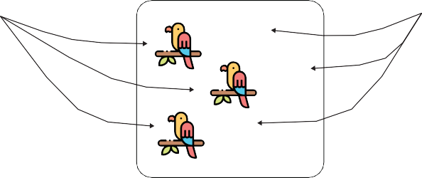

# Chapter 2

## The Spring Context

***This chapter covers***

- Understanding the need for Spring context

- Adding new object instances to the Spring context

In this chapter, you start learning how to work with a crucial Spring framework ele-ment: the context (also known as the application context in a Spring app). Imagine the context as a place in the memory of your app in which we add all the object instances that we want the framework to manage. By default, Spring doesn’t know any of the objects you define in your application. To enable Spring to see your objects, you need to add them to the context. Later in this book we discuss using different capabilities provided by Spring in apps. You’ll learn that plugging in such features is done through the context by adding object instances and establishing relationships among them. Spring uses the instances in the context to connect your app to various functionalities it provides. You’ll learn the basics of the most import-ant features (e.g., transactions, testing, etc.) throughout the book.

Learning what Spring context is and how it works is the first step in learning to use Spring, because without knowing how to manage the Spring context, almost nothing else you’ll learn to do with it will be possible. The context is a complex mechanism that enables Spring to control instances you define. This way, it allows you to use the capabilities the framework offers.

We start in this chapter by learning how to add object instances to the Spring con-text. In chapter 3, you’ll learn how to refer to the instances you added and establish relationships among them.

We’ll name these object instances “beans.” Of course, for the syntaxes you need to learn we’ll write code snippets, and you can find all these snippets in the projects pro-vided with the book (you can download the projects from the “Book resources” sec-tion of the live book). I’ll enhance the code examples with visuals and detailed explanations of the approaches.

Because I want to make your introduction to Spring progressive and take every-thing step by step, in this chapter we focus on the syntaxes you need to know for work-ing with the Spring context. You’ll find out later that not all the objects of an app need to be managed by Spring, so you don’t need to add all the object instances of your app to the Spring context. For the moment, I invite you to focus on learning the approaches for adding an instance for Spring to manage.

## Creating a Maven project

In this section, we’ll discuss creating a Maven project. Maven is not a subject directly related to Spring, but it’s a tool you use to easily manage an app’s build process regardless of the framework you use. You need to know Maven project basics to follow the coding examples. Maven is also one of the most used building tools for Spring projects in real-world scenarios (with Gradle, another build tool, taking second place, but we won’t discuss it in this book). Because Maven’s such a well-known tool, you may already know how to create a project and add dependencies to it using its configura-tion. In this case, you can skip this section and go directly to section 2.2.

A build tool is software we use to build apps more easily. You configure a build tool to do the tasks that are part of building the app instead of manually doing them. Some examples of tasks that are often part of building the app are as follows:

- Downloading the dependencies needed by your app

- Running tests

- Validating that the syntax follows rules that you define

- Checking for security vulnerabilities

- Compiling the app

- Packaging the app in an executable archive

So that our examples can easily manage dependencies, we need to use a build tool for the projects we develop. This section teaches only what you need to know for develop-ing the examples in this book; we’ll go step by step through the process of creating a

Maven project, and I’ll teach you the essentials regarding its structure. If you’d like to learn more details about using Maven, I recommend *Introducing Maven: A Build Tool for Today’s Java Developers* by Balaji Varanasi
(APress, 2019).

Let’s start at the very beginning. First, as with developing any other app, you need an integrated development environment (IDE). Any professional IDE nowadays offers support for Maven projects, so you can choose any you’d like: IntelliJ IDEA, Eclipse, Spring STS, Netbeans, and so on. For this book, I use IntelliJ IDEA, which is the IDE I use most often. Don’t worry—the structure of the Maven project is the same regard-less of which IDE you choose.

Let’s start by creating a new project. You create a new project in IntelliJ from File \> New \> Project. This will get you to a window like the one in figure 2.1.

**Figure 2.1 Creating a new Maven project. After going to File \> New \> Project, you get to this window, where you need to select the type of the project from the left panel. In our case, we choose Maven. In the upper part of the window, you select the JDK you wish to use to compile and run the project.**

Once you’ve selected the type of your project, in the next window
(figure 2.2) you need to give it a name. In addition to the project
name and choosing the location in which to store it, for a Maven project you can also specify the following:

- A group ID, which we use to group multiple related projects

- An artifact ID, which is the name of the current application

- A version, which is an identifier of the current implementation state

**Optionally, you provide a group ID, an artifact ID, and a version. If you don’t configure these attributes, your IDE will use default values.**

**You need to give a name to your project and store it somewhere in your computer.**

**Figure 2.2 Before you finish creating your project, you need to give it a name and specify where you want your IDE to store the project. Optionally, you can give your project a group ID, an artifact ID, and a version. You then press the Finish button in the lower right corner to complete creating the project.**

In a real-world app, these three attributes are essential details, and it’s important to provide them. But in our case, because we only work on theoretical examples, you can omit them and leave your IDE to fill in some default values for these characteristics.

Once you’ve created the project, you’ll find its structure looks like the one pre-sented in figure 2.3. Again, the Maven project structure does not depend on the IDE you choose for developing your projects. When you look first at your project, you observe two main things:

- The “src” folder (also known as the source folder), where you’ll put
everything that belongs to the app.

- The pom.xml file, where you write the configurations of your Maven
project, like adding new dependencies.

Maven organizes the “src” folder into the following folders:

- The “main” folder, where you store the application’s source code. This
folder contains the Java code and the configurations separately into two different sub-folders named “java” and “resources.”

- The “test” folder, where you store the unit tests’ source code (we
discuss more about unit tests and how to define them in chapter 15).

**All your source code goes into this folder.**

**The source code for your app goes into this folder.**

**The source code for the unit tests**

**goes into this folder.**

**The Java source code for your app goes into this folder.**

**Other resources like properties files or configuration files go into this folder.**

**You change the pom.xml file to manage the Maven project configuration.**

**Figure 2.3 How a Maven project is organized. Inside the src folder, we add everything that belongs to the app: the application’s source code goes into the main folder, and the source code for the unit tests goes into the test folder. In the pom.xml file we write configurations for the Maven project (in our examples we’ll primarily use it to define the dependencies).**

Figure 2.4 shows you how to add new source code to the “main/java” folder of the Maven project. New classes of the app go into this folder.

**Inside the “java” folder you create your usual Java packages and classes. Here, I’ve created**

**a package named “main” and a new Main class inside it.**

**Figure 2.4 Inside the “java” folder, you create the usual Java packages and classes of your application. These are the classes that define the whole logic of your app and make use of the dependencies you provide.**

In the projects we create in this book, we use plenty of external dependencies: librar-ies or frameworks we use to implement the functionality of the examples. To add these dependencies to your Maven projects, we need to change the content of the pom.xml file. In the following listing, you find the default content of the pom.xml file immediately after creating the Maven project.

**Listing 2.1 The default content of the pom.xml file**

\<?xml version="1.0" encoding="UTF-8"?\>

\<project xmlns="<http://maven.apache.org/POM/4.0.0>" xmlns:xsi="<http://www.w3.org/2001/XMLSchema-instance>" xsi:schemaLocation="<http://maven.apache.org/POM/4.0.0> <http://maven.apache.org/xsd/maven-4.0.0.xsd>"\>

\<modelVersion\>4.0.0\</modelVersion\>

\<groupId\>org.example\</groupId\>

\<artifactId\>sq-ch2-ex1\</artifactId\>

\<version\>1.0-SNAPSHOT\</version\>

\</project\>

With this pom.xml file, the project doesn’t use any external dependency. If you look in the project’s external dependencies folder, you should only see the JDK (figure 2.5).

**Initially, inside the External Libraries section of your project, you only have**

**the JDK. Once you add more dependencies to your project, other files will appear**

**here, represented as external dependencies.**

**Figure 2.5 With a default pom.xml file, your project only uses the JDK as an external dependency. One of the reasons you change the pom.xml file (and the one we’ll use in this book) is to add new dependencies your app needs.**

The following listing shows you how to add external dependencies to your project. You write all the dependencies between the \<dependencies\> \</dependencies\> tags. Each dependency is represented by a \<dependency\> \</dependency\> group of tags where you write the dependency’s attributes: the dependency’s group ID, artifact name, and version. Maven will search for the dependency by the values you provided for these three attributes and will download the dependencies from a repository. I won’t go into detail on how to configure a custom repository. You just need to be aware that Maven will download the dependencies (usually jar files) by default from a repository named the Maven central. You can find the downloaded jar files in your project’s external dependencies folder, as presented in figure 2.6.

**Listing 2.2 Adding a new dependency in the pom.xml file**

\<?xml version="1.0" encoding="UTF-8"?\>

\<project xmlns="<http://maven.apache.org/POM/4.0.0>" xmlns:xsi="<http://www.w3.org/2001/XMLSchema-instance>" xsi:schemaLocation="<http://maven.apache.org/POM/4.0.0> <http://maven.apache.org/xsd/maven-4.0.0.xsd>"\>

\<modelVersion\>4.0.0\</modelVersion\>

\<groupId\>org.example\</groupId\>

\<artifactId\>sq_ch2_ex1\</artifactId\>

\<version\>1.0-SNAPSHOT\</version\>

\<dependencies\>

\<dependency\>

**You need to write the dependencies for the project between the \<dependencies\> and**

**\</dependecies\> tags.**

\<groupId\>org.springframework\</groupId\>

\<artifactId\>spring-jdbc\</artifactId\>

\<version\>5.2.6.RELEASE\</version\>

\</dependency\>

\</dependencies\>

\</project\>

**A dependency is represented by a group of \<dependency\>**

**\</dependency\> tags.**

Once you’ve added the dependency in the pom.xml file, as presented in the previous listing, the IDE downloads them, and you’ll now find these dependencies in the “External Libraries” folder (figure 2.6).

Now we can move to the next section, where we discuss the basics of the Spring context. You’ll create Maven projects, and you’ll learn to use a Spring dependency named spring-context, to manage the Spring context.

**Adding the Spring context dependency**

**adds multiple files as external dependencies.**

**Figure 2.6 When you add a new dependency to the pom.xml file, Maven downloads the jar files representing that dependency. You find these jar files in the External Libraries folder of the project.**

## Adding new beans to the Spring context

In this section, you’ll learn how to add new object instances (i.e., beans) to the Spring context. You’ll find out that you have multiple ways to add beans in the Spring context such that Spring can manage them and plug features it provides into your app. Depending on the action, you’ll choose a specific way to add the bean; we’ll discuss when to select one or another. You can add beans in the context in the following ways (which we’ll describe later in this chapter):

- Using the @Bean annotation

- Using stereotype annotations

- Programmatically

Let’s first create a project with a reference to no framework—not even Spring. We’ll then add the dependencies needed to use the Spring context and create it (figure 2.7). This example will serve as a prerequisite to adding beans to the Spring context examples that we’re going to work on in sections 2.2.1 through 2.2.3.

We create a Maven project and define a class. Because it’s funny to imagine, I’ll consider a class named Parrot with only a String attribute representing the name of the parrot (listing 2.3). Remember, in this chapter, we only focus on adding beans to the Spring context, so it’s okay to use any object that helps you better remember the

**What you want to achieve**

**We’ll start by independently creating an object of the type Parrot and the Spring context.**

**The Spring context is initially empty.**

**Later, we move the Parrot instance into the context to let Spring know the instance and be able to manage it for us.**

**Figure 2.7 To start, we create an object instance and the empty Spring context.**

syntaxes. You find the code for this example in the project “sq-ch2-ex1” (you can download the projects from the “Resources” section of the live book). For your proj-ect, you can use the same name or choose the one you prefer.

**Listing 2.3 The Parrot class**

public class Parrot { private String name;

// Omitted getters and setters

}

You can now define a class containing the main method and create an instance of the class Parrot, as presented in the following listing. I usually name this class Main.

**Listing 2.4 Creating an instance of the Parrot class**

public class Main {

public static void main(String\[\] args) { Parrot p = new Parrot();

}

}

It’s now time to add the needed dependencies to our project. Because we’re using Maven, I’ll add the dependencies in the pom.xml file, as presented in the following listing.

**Listing 2.5 Adding the dependency for Spring context**

\<project xmlns="<http://maven.apache.org/POM/4.0.0>" xmlns:xsi="<http://www.w3.org/2001/XMLSchema-instance>" xsi:schemaLocation="<http://maven.apache.org/POM/4.0.0>

<http://maven.apache.org/xsd/maven-4.0.0.xsd>"\>

\<modelVersion\>4.0.0\</modelVersion\>

\<groupId\>org.example\</groupId\>

\<artifactId\>sq-ch2-ex1\</artifactId\>

\<version\>1.0-SNAPSHOT\</version\>

\<dependencies\>

\<dependency\>

\<groupId\>org.springframework\</groupId\>

\<artifactId\>spring-context\</artifactId\>

\<version\>5.2.6.RELEASE\</version\>

\</dependency\>

\</dependencies\>

\</project\>

A critical thing to observe is that Spring is designed to be modular. By modular, I mean that you don’t need to add the whole Spring to your app when you use some-thing out of the Spring ecosystem. You just need to add those parts that you use. For this reason, in listing 2.5, you see that I’ve only added the spring-context depen-dency, which instructs Maven to pull the needed dependencies for us to use the Spring context. Throughout the book, we’ll add various dependencies to our projects according to what we implement, but we’ll always only add what we need.

**NOTE** You might wonder how I knew which Maven dependency I should
add. The truth is that I’ve used them so many times I know them by heart. How-ever, you don’t need to memorize them. Whenever you work with a new Spring project, you can search for the dependencies you need to add directly in the Spring reference
([https://docs.spring.io/spring-framework/docs/](https://docs.spring.io/spring-framework/docs/current/spring-framework-reference/core.html)
[current/spring-framework-reference/core.html](https://docs.spring.io/spring-framework/docs/current/spring-framework-reference/core.html)). Generally, Spring depen-dencies are part of the org.springframework group ID.

With the dependency added to our project, we can create an instance of the Spring context. In the next listing, you can see how I’ve changed the main method to create the Spring context instance.

**Listing 2.6 Creating the instance of the Spring context**

public class Main {

public static void main(String\[\] args) { var context =

new AnnotationConfigApplicationContext();

**Creates an instance of the Spring context**

Parrot p = new Parrot();

}

}

**NOTE** We use the AnnotationConfigApplicationContext class to create
the Spring context instance. Spring offers multiple implementations. Because in most cases you’ll use the AnnotationConfigApplicationContext class (the implementation that uses the most used today’s approach: annotations), we’ll focus on this one in this book. Also, I only tell you what you need to know for the current discussion. If you’re just getting started with Spring, my recom-mendation is to avoid getting into details with context implementations and these classes’ inheritance chains. Chances are that if you do you’ll get lost with unimportant details instead of focusing on the essential things.

As presented in figure 2.8, you created an instance of Parrot, added the Spring con-text dependencies to your project, and created an instance of the Spring context. Your objective is to add the Parrot object to the context, which is the next step.

**What you did**

**You created a parrot instance, but it’s not in the Spring context.**

**What you want to achieve**

**Adding the parrot instance in the Spring context will allow Spring to “see” the instance.**

**Spring context**

**You defined the Spring context, but it’s now empty.**

**Figure 2.8 You created the Spring context instance and a Parrot instance. Now, you want to add the Parrot instance inside the Spring context to make Spring aware of this instance.**

We just finished creating the prerequisite (skeleton) project, which we’ll use in the next sections to understand how to add beans to the Spring context. In section 2.2.1, we continue learning how to add the instance to the Spring context using the @Bean annotation. Further, in sections 2.2.2 and 2.2.3, you’ll also learn the alternatives of adding the instance using stereotype annotations and doing it programmatically. After discussing all three approaches, we’ll compare them, and you’ll learn the best circum-stances for using each.

### Using the @Bean annotation to add beans into the Spring context

In this section, we’ll discuss adding an object instance to the Spring context using the @Bean annotation. This makes it possible for you to add the instances of the classes defined in your project (like Parrot in our case), as well as classes you didn’t create yourself but you use in your app. I believe this approach is the easiest to understand when starting out. Remember that the reason you learn to add beans to the Spring con-text is that Spring can manage only the objects that are part of it. First, I’ll give you a straightforward example of how to add a bean to the Spring context using the @Bean annotation. Then I’ll show you how to add multiple beans of the same or different type.

The steps you need to follow to add a bean to the Spring context using the @Bean

annotation are as follows (figure 2.9):

**1** Define a configuration class (annotated with @Configuration) for your project, which, as we’ll discuss later, we use to configure the context of Spring.

**2** Add a method to the configuration class that returns the object instance you want to add to the context and annotate the method with the @Bean annotation.

**3** Make Spring use the configuration class defined in step 1. As you’ll learn later, we use configuration classes to write different configurations for the framework.

Let’s follow these steps and apply them in the project named “sq-c2-ex2.” To keep all the steps we discuss separated, I recommend you create new projects for each example.

**NOTE** Remember, you can find the book’s projects in the “Resources”
sec-tion of the live book.

@**Configuration**

public class ProjectConfig {

@**Bean**

Parrot parrot() {

var p = new Parrot(); p.setName("Koko"); return p;

**Step 2**

**Step 1**

**Spring context**

}

}

**Step 3**

var **context** = new AnnotationConfigApplicationContext(**ProjectConfig.class**);

**Figure 2.9 Steps for adding the bean to the context using the @Bean annotation. By adding the instance to the Spring context, you make the framework aware of the object, enabling it to manage the instance.**

**NOTE** A configuration class is a special class in Spring
applications that we use to instruct Spring to do specific actions. For example, we can tell Spring to cre-ate beans or to enable certain functionalities. You will learn different things you can define in configuration classes throughout the rest of the book.

**Step** **1: Defining a configuration class in your project**

The first step is to create a configuration class in the project. A Spring configuration class is characterized by the fact that it is annotated with the @Configuration annota-tion. We use the configuration classes to define various Spring-related configurations for the project. Throughout the book, you’ll learn different things you can configure using the configuration classes. For the moment we focus only on adding new instances to the Spring context. The next listing shows you how to define the configu-ration class. I named this configuration class ProjectConfig.

**Listing 2.7 Defining a configuration class for the project**

@Configuration

public class ProjectConfig {

}

**We use the @Configuration annotation to define this class as a Spring configuration class.**

**NOTE** I separate the classes into different packages to make the
code easier to understand. For example, I create the configuration classes in a package named config, and the Main class in a package named main. Organizing the classes into packages is a good practice; I recommend you follow it in your real-world implementations as well.

**Step** **2: Create a method that returns the bean, and annotate the method with @Bean**

One of the things you can do with a configuration class is add beans to the Spring con-text. To do this, we need to define a method that returns the object instance we wish to add to the context and annotate that method with the @Bean annotation, which lets Spring know that it needs to call this method when it initializes its context and adds the returned value to the context. The next listing shows the changes to the configura-tion class to implement the current step.

**NOTE** For the projects in this book, I use Java 11: the latest
long-term sup-ported Java version. More and more projects are adopting this version. Gener-ally, the only specific feature I use in the code snippets that doesn’t work with an earlier version of Java is the var reserved type name. I use var here and there to make the code shorter and easier to read, but if you’d like to use an earlier version of Java (say Java 8, for example), you can replace var with the inferred type. This way, you’ll make the projects work with Java 8 as well.

**Listing 2.8 Defining the @Bean method**

@Configuration

public class ProjectConfig { @Bean

**By adding the @Bean annotation, we instruct Spring to call this method when at context initialization and add the returned value to the context.**

Parrot parrot() {

var p = new Parrot(); p.setName("Koko"); return p;

}

}

**Set a name for the parrot we’ll use later when we test the app.**

**Spring adds to its context the Parrot instance returned by the method.**

Observe that the name I used for the method doesn’t contain a verb. You probably learned that a Java best practice is to put verbs in method names because the methods generally represent actions. But for methods we use to add beans in the Spring con-text, we don’t follow this convention. Such methods represent the object instances they return and that will now be part of the Spring context. The method’s name also becomes the bean’s name (as in listing 2.8, the bean’s name is now “parrot”). By con-vention, you can use nouns, and most often they have the same name as the class.

**Step 3****: Make Spring initialize its context using the newly created configuration class**

We’ve implemented a configuration class in which we tell Spring the object instance that needs to become a bean. Now we need to make sure Spring uses this configura-tion class when initializing its context. The next listing shows you how to change the instantiation of the Spring context in the main class to use the configuration class we implemented in the first two steps.

**Listing 2.9 Initializing the Spring context based on the defined configuration class**

public class Main {

public static void main(String\[\] args) { var context =

new AnnotationConfigApplicationContext( ProjectConfig.class);

**When creating the Spring context instance, send the configuration class as a parameter to instruct Spring to use it.**

}

}

To verify the Parrot instance is indeed part of the context now, you can refer to the instance and print its name in the console, as presented in the following listing.

**Listing 2.10 Referring to the Parrot instance from the context**

public class Main {

public static void main(String\[\] args) { var context =

new AnnotationConfigApplicationContext( ProjectConfig.class);

Parrot p = context.getBean(Parrot.class);

**Gets a reference of a bean of type Parrot from the Spring context**

System.out.println(p.getName());

}

}

Now you’ll see the name you gave to the parrot you added in the context in the con-sole, in my case Koko.

**NOTE** In real-world scenarios, we use unit and integration tests to
validate that our implementations work as desired. The projects in this book imple-ment unit tests to validate the discussed behavior. Because this is a “getting started” book, you might not yet be aware of unit tests. To avoid creating con-fusion and allow you to focus on the discussed subject, we won’t discuss unit tests until chapter 15. However, if you already know how to write unit tests and reading them helps you better understand the subject, you can find all the unit tests implemented in the test folder of each of our Maven projects. If you don’t yet know how unit tests work, I recommend focusing only on the discussed subject.

As in the previous example, you can add any kind of object to the Spring context (fig-ure 2.10). Let’s also add a String and an Integer and see that it’s working.

**Adding more beans of different types into the Spring context**

**Spring context**

Hello

10

**Figure 2.10 You can add any object to the Spring context to make Spring aware of it.**

The next listing shows you how I changed the configuration class to also add a bean of type String and a bean of type Integer.

**Listing 2.11 Adding two more beans to the context**

@Configuration

public class ProjectConfig {

@Bean

Parrot parrot() {

var p = new Parrot(); p.setName("Koko"); return p;

}

@Bean

String hello() { return "Hello";

**Adds the string “Hello” to the Spring context**

}

@Bean

Integer ten() { return 10;

**Adds the integer 10 to the Spring context**

}

}

**NOTE** Remember the Spring context’s purpose: we add the instances
we expect Spring needs to manage. (This way, we plug in functionalities offered by the framework.) In a real-world app, we won’t add every object to the Spring context. Starting with chapter 4, when our examples will become closer to code in a production-ready app, we’ll also focus more on which objects Spring needs to manage. For the moment, focus on the approaches you can use to add beans to the Spring context.

You can now refer to these two new beans in the same way we did with the parrot. The next listing shows you how to change the main method to print the new beans’ values.

**Listing 2.12 Printing the two new beans in the console**

public class Main {

public static void main(String\[\] args) {

var context = new AnnotationConfigApplicationContext( ProjectConfig.class);

Parrot p = context.getBean(Parrot.class); System.out.println(p.getName());

String s = context.getBean(String.class); System.out.println(s);

Integer n = context.getBean(Integer.class); System.out.println(n);

}

}

**You don’t need to do any explicit casting. Spring looks for a bean of the type you requested in its**

**context. If such a bean doesn’t exist, Spring will throw an exception.**

Running the app now, the values of the three beans will be printed in the console, as shown in the next code snippet.

Koko Hello 10

Thus far we added one or more beans of different types to the Spring context. But could we add more than one object of the same type
(figure 2.11)? If yes, how can we individually refer to these objects?
Let’s create a new project, “sq-ch2-ex3,” to demon-strate how you can add multiple beans of the same type to the Spring context and how you can refer to them afterward.

**Adding more beans of the same type into the Spring context**

**Spring context**

parrot1

**Each instance has an unique name (identifier). You use the identifier later to refer to the instance.**

parrot2

parrot3

**Figure 2.11 You can add more beans of the same type to the Spring context by using multiple methods annotated with @Bean. Each instance will have a unique identifier. To refer to them afterward, you’ll need to use the beans’ identifiers.**

**NOTE** Don’t confuse the name of the bean with the name of the
parrot. In our example, the beans’ names (or identifiers) in the Spring context are par-rot1, parrot2, and parrot3 (like the name of the @Bean methods defining them). The names I gave to the parrots are Koko, Miki, and Riki. The parrot name is just an attribute of the Parrot object, and it doesn’t mean anything to Spring.

You can declare as many instances of the same type as you wish by simply declaring more methods annotated with the @Bean annotation. The following listing shows you how I’ve declared three beans of type Parrot in the configuration class. You find this example with the project “sq-ch2-ex3.”

**Listing 2.13 Adding multiple beans of the same type to the Spring context**

@Configuration

public class ProjectConfig {

@Bean

Parrot parrot1() {

var p = new Parrot(); p.setName("Koko"); return p;

}

@Bean

Parrot parrot2() {

var p = new Parrot(); p.setName("Miki"); return p;

}

@Bean

Parrot parrot3() {

var p = new Parrot();

p.setName("Riki"); return p;

}

}

Of course, you can’t get the beans from the context anymore by only specifying the type. If you do, you’ll get an exception because Spring cannot guess which instance you’ve declared you refer to. Look at the following listing. Running such a code throws an exception in which Spring tells you that you need to be precise, which is the instance you want to use.

**Listing 2.14 Referring to a Parrot instance by type**

public class Main {

public static void main(String\[\] args) { var context = new

AnnotationConfigApplicationContext(ProjectConfig.class);

Parrot p = context.getBean(Parrot.class); System.out.println(p.getName());

}

}

**You’ll get an exception on this line because Spring cannot guess which of the three Parrot instances you refer to.**

When running your application, you’ll get an exception similar to the one presented by the next code snippet.

Exception in thread "main" org.springframework.beans.factory.NoUniqueBeanDefinitionException: No qualifying bean of type 'main.Parrot' available: expected single matching bean but found 3:

parrot1,parrot2,parrot3 at …

**Names of the Parrot beans in the context**

To solve this ambiguity problem, you need to refer precisely to one of the instances by using the bean’s name. By default, Spring uses the names of the methods annotated with @Bean as the beans’ names themselves. Remember that’s why we don’t name the @Bean methods using verbs. In our case, the beans have the names parrot1, parrot2, and parrot3 (remember, the method represents the bean). You can find these names in the previous code snippet in the message of the exception. Did you spot them? Let’s change the main method to refer to one of these beans explicitly by using its name. Observe how I referred to the parrot2 bean in the following listing.

**Listing 2.15 Referring to a bean by its identifier**

public class Main {

public static void main(String\[\] args) { var context = new

AnnotationConfigApplicationContext(ProjectConfig.class);

Parrot p = context.getBean("parrot2", Parrot.class);  System.out.println(p.getName());

}

}

**First parameter is the name of the instance to which we refer**

Running the app now, you’ll no longer get an exception. Instead, you’ll see in the console the name of the second parrot, Miki.

If you’d like to give another name to the bean, you can use either one of the name

or the value attributes of the @Bean annotation. Any of the following syntaxes will change the name of the bean in "miki":

- @Bean(name = "miki")

- @Bean(value = "miki")

- @Bean("miki")

In the next code snippet, you can observe the change as it appears in code, and if you’d like to run this example, you find it in the project named “sq-ch2-ex4”:

@Bean(name = "miki") Parrot parrot2() {

var p = new Parrot(); p.setName("Miki"); return p;

**Sets the name of the bean**

**Sets the name of the parrot**

}

**Defining a bean as primary**

Earlier in this section we discussed that you could have multiple beans of the same kind in the Spring context, but you need to refer to them using their names. There’s another option when referring to beans in the context when you have more of the same type.

When you have multiple beans of the same kind in the Spring context you can make one of them *primary*. You mark the bean you want to be primary using the @Primary annotation. A primary bean is the one Spring will choose if it has multiple options and you don’t specify a name; the primary bean is simply Spring’s default choice. The next code snippet shows you what the @Bean method annotated as primary looks like:

@Bean @Primary

Parrot parrot2() {

var p = new Parrot(); p.setName("Miki"); return p;

}

If you refer to a Parrot without specifying the name, Spring will now select Miki by default. Of course, you can only define one bean of a type as primary. You find this example implemented in the project “sq-ch2-ex5.”

### Using stereotype annotations to add beans to the Spring context

In this section, you’ll learn a different approach for adding beans to the Spring con-text (later in this chapter, we also compare the approaches and discuss when to choose one or another). Remember, adding beans to the Spring context is essential because it’s how you make Spring aware of the object instances of your application, which need to be managed by the framework. Spring offers you more ways to add beans to its context. In different scenarios, you’ll find using one of these approaches is more comfortable than another. For example, with stereotype annotations, you’ll observe you write less code to instruct Spring to add a bean to its context.

Later you’ll learn that Spring offers multiple stereotype annotations. But in this section, I want you to focus on how to use a stereotype annotation in general. We’ll take the most basic of these, @Component, and use it to demonstrate our examples.

With stereotype annotations, you add the annotation above the class for which you

need to have an instance in the Spring context. When doing so, we say that you’ve marked the class as a component. When the app creates the Spring context, Spring creates an instance of the class you marked as a component and adds that instance to its context. We’ll still have a configuration class when we use this approach to tell Spring where to look for the classes annotated with stereotype annotations. Moreover, you can use both the approaches (using @Bean and stereotype annotations together; we’ll work on these types of complex examples in later chapters).

The steps we need to follow in the process are as follows (figure 2.12):

**1** Using the @Component annotation, mark the classes for which you want Spring to add an instance to its context (in our case Parrot).

**2** Using @ComponentScan annotation over the configuration class, instruct Spring on where to find the classes you marked.

Let’s take our example with the Parrot class. We can add an instance of the class in the Spring context by annotating the Parrot class with one of the stereotype annota-tions, say @Component.

**STEP 1**

**@Component**

public class Parrot {

// Omitted code

}

**Tells Spring where to look for classes annotated with stereotype annotations**

**STEP 2**

@Configuration **@ComponentScan(basePackages = "main")** public class ProjectConfig {

}

**Figure 2.12 When using stereotype annotations, consider two steps. First, use the stereotype annotation (@Component) to annotate the class for which you want Spring to add a bean to its context. Second, use the @ComponentScan annotation to tell Spring where to look for classes annotated with stereotype annotations.**

The next listing shows you how to use the @Component annotation for the Parrot class. You can find this example in the project “sq-ch2-ex6.”

**Listing 2.16 Using a stereotype annotation for the Parrot class**

@Component

public class Parrot { private String name;

public String getName() { return name;

**By using the @Component annotation over the class, we instruct Spring to create an instance of this class and add it to its context.**

}

public void setName(String name) { this.name = name;

}

}

But wait! This code won’t work just yet. By default, Spring doesn’t search for classes annotated with stereotype annotations, so if we just leave the code as-is, Spring won’t add a bean of type Parrot in its context. To tell Spring it needs to search for classes annotated with stereotype annotations, we use the @ComponentScan annotation over the configu-ration class. Also, with the @ComponentScan annotation, we tell Spring where to look for these classes. We enumerate the packages where we defined the classes with stereotype annotations. The next listing shows you how to use the @ComponentScan annotation over the configuration class of the project. In my case, the name of the package is “main.”

**Listing 2.17 Using the @ComponentScan annotation to tell Spring where to look**

@Configuration

@ComponentScan(basePackages = "main") public class ProjectConfig {

}

Now you told Spring the following:

**Using the basePackages attribute of the annotation, we tell Spring where to look for classes annotated with stereotype annotations.**

**1** Which classes to add an instance to its context (Parrot)

**2** Where to find these classes (using @ComponentScan)

**NOTE** We don’t need methods anymore to define the beans. And it now
looks like this approach is better because you achieve the same thing by writ-ing less code. But wait until the end of this chapter. You’ll learn that both approaches are useful, depending on the scenario.

You can continue writing the main method as presented in the following listing to prove that Spring creates and adds the bean in its context.

**Listing 2.18 Defining the main method to test the Spring configuration**

**Prints the default String representation of the instance taken from the Spring context**

public class Main {

public static void main(String\[\] args) { var context = new

AnnotationConfigApplicationContext(ProjectConfig.class);

Parrot p = context.getBean(Parrot.class);

System.out.println(p); System.out.println(p.getName());

}

}

**Prints null because we did not assign any name to the parrot instance added by Spring in its context**

Running this application, you’ll observe Spring added a Parrot instance to its context because the first value printed is the default String representation of this instance. However, the second value printed is null because we did not assign any name to this parrot. Spring just creates the instance of the class, but it’s still our duty if we want to change this instance in any way afterward (like assigning it a name).

Now that we’ve covered the two most frequently encountered ways you add beans to the Spring context, let’s make a short comparison of them
(table 2.1).

What you’ll observe is that in real-world scenarios you’ll use stereotype annotations as much as possible (because this approach implies writing less code), and you’ll only use the @Bean when you can’t add the bean otherwise (e.g., you create the bean for a class that is part of a library so you cannot modify that class to add the stereotype annotation).

**Table 2.1 Advantages and disadvantages: A comparison of the two ways of adding beans to the Spring context, which tells you when you would use either of them**

<table style="width:80%;"> <colgroup> <col style="width: 43%" /> <col style="width: 36%" /> </colgroup> <thead> <tr> <th><blockquote> 
<strong>Using the @Bean annotation</strong>
 </blockquote></th> <th><blockquote> 
<strong>Using stereotype annotations</strong>
 </blockquote></th> </tr> </thead> <tbody> <tr> <td><ol type="1"> <li>
You have full control over the instance creation you add to the Spring context. It is your responsibility to create and configure the instance in the body of the method annotated with @Bean. Spring only takes that instance and adds it to the context as-is.
</li> <li>
You can use this method to add more instances of the same type to the Spring context. Remember, in section 2.1.1 we added three Parrot instances into the Spring context.
</li> <li>
You can use the @Bean annotation to add to the Spring context any object instance. The class that defines the instance doesn’t need to be defined in your app. Remember, earlier we added a String and an Integer to the Spring context.
</li> <li>
You need to write a separate method for each bean you create, which adds boilerplate code to your app. For this reason, we prefer using @Bean as a second option to stereotype annotations in our projects.
</li> </ol></td> <td><ol type="1"> <li>
You only have control over the instance after the framework creates it.
</li> <li>
This way, you can only add one instance of the class to the context.
</li> <li>
You can use stereotype annotations only to create beans of the classes your applica-tion owns. For example, you couldn’t add a bean of type String or Integer like we did in section 2.1.1 with the @Bean annota-tion because you don’t own these classes to change them by adding a stereotype annotation.
</li> <li>
Using stereotype annotations to add beans to the Spring context doesn’t add boiler-plate code to your app. You’ll prefer this approach in general for the classes that belong to your app.
</li> </ol></td> </tr> </tbody> </table>

**Using @PostConstruct to manage the instance after its creation**

As we’ve discussed in this section, using stereotype annotations you instruct Spring to create a bean and add it to its context. But, unlike using the @Bean annotation, you don’t have full control over the instance creation. Using @Bean, we were able to define a name for each of the Parrot instances we added to the Spring context, but using @Component, we didn’t get a chance to do something after Spring called the constructor of the Parrot class. What if we want to execute some instructions right after Spring creates the bean? We can use the @PostConstruct annotation.

Spring borrows the @PostConstruct annotation from Java EE. We can also use this annotation with Spring beans to specify a set of instructions Spring executes after the bean creation. You just need to define a method in the component class and annotate that method with @PostConstruct, which instructs Spring to call that method after the constructor finishes its execution.

Let’s add to pom.xml the Maven dependency needed to use the @PostConstruct

annotation:

\<dependency\>

\<groupId\>javax.annotation\</groupId\>

\<artifactId\>javax.annotation-api\</artifactId\>

\<version\>1.3.2\</version\>

\</dependency\>

You don’t need to add this dependency if you use a Java version smaller than Java

11\. Before Java 11, the Java EE dependencies were part of the JDK. With Java 11, the JDK was cleaned of the APIs not related to SE, including the Java EE dependencies.

If you wish to use functionalities that were part of the removed APIs
(like @PostCon-struct), you now need to explicitly add the dependency
in your app.

Now you can define a method in the Parrot class, as presented in the next code snippet:

@Component

public class Parrot { private String name;

@PostConstruct public void init() {

this.name = "Kiki";

}

// Omitted code

}

You find this example in the project “sq-ch2-ex7.” If you now print the name of the parrot in the console, you’ll observe the app prints the value Kiki in the console.

Very similarly, but less encountered in real-world apps, you can use an annotation named @PreDestroy. With this annotation, you define a method that Spring calls imme-diately before closing and clearing the context. The @PreDestroy annotation is also described in JSR-250 and borrowed by Spring. But generally I recommend developers avoid using it and find a different approach to executing something before Spring clears the context, mainly because you can expect Spring to fail to clear the context. Say you defined something sensitive (like closing a database connection) in the @Pre-Destroy method; if Spring doesn’t call the method, you may get into big problems.

### Programmatically adding beans to the Spring context

In this section, we discuss adding beans programmatically to the Spring context. We’ve had the option of programmatically adding beans to the Spring context with Spring 5, which offers great flexibility because it enables you to add new instances in the context directly by calling a method of the context instance. You’d use this approach when you want to implement a custom way of adding beans to the context and the @Bean or the stereotype annotations are not enough for your needs. Say you need to register specific beans in the Spring context depending on specific configura-tions of your application. With the @Bean and stereotype annotations, you can imple-ment most of the scenarios, but you can’t do something like the code presented in the next snippet:

if (condition) { registerBean(b1);

} else {

registerBean(b2);

}

**If the condition is true, add a specific bean to the Spring context.**

**Otherwise, add another bean to the Spring context.**

To keep using our parrots example, the scenario is as follows: The app reads a collec-tion of parrots. Some of them are green; others are orange. You want the app to add to the Spring context only the parrots that are green (figure 2.13).

**From a collection of parrots, you want to add only those that are green to the Spring context.**

**Spring context**

for (Parrot p : **parrots**) { if (parrot.isGreen()) {

context.registerBean(...);

}

}

**Using the registerBean() method you can write custom logic to add the desired instances to the Spring context.**

**Figure 2.13 Using the registerBean() method to add specific object instances to the Spring context**

Let’s see how this method works. To add a bean to the Spring context using a pro-grammatic approach, you just need to call the registerBean() method of the Appli-cationContext instance. The registerBean() has four parameters, as presented in the next code snippet:

\<T\> void registerBean( String beanName, Class\<T\> beanClass, Supplier\<T\> supplier,

BeanDefinitionCustomizer... customizers);

**1** Use the first parameter beanName to define a name for the bean you add in the Spring context. If you don’t need to give a name to the bean you’re adding, you can use null as a value when you call the method.

**2** The second parameter is the class that defines the bean you add to the context. Say you want to add an instance of the class Parrot; the value you give to this parameter is Parrot.class.

**3** The third parameter is an instance of Supplier. The implementation of this Supplier needs to return the value of the instance you add to the context. Remember, Supplier is a functional interface you find in the java.util

.function package. The purpose of a supplier implementation is to return a value you define without taking parameters.

**4** The fourth and last parameter is a varargs of BeanDefinitionCustomizer. (If this doesn’t sound familiar, that’s okay; the BeanDefinitionCustomizer is just an interface you implement to configure different characteristics of the bean; e.g., making it primary.) Being defined as a varargs type, you can omit this parameter entirely, or you can give it more values of type BeanDefinitionCustomizer.

In the project “sq-ch2-ex8,” you find an example of using the registerBean() method. You observe that this project’s configuration class is empty, and the Parrot class we use for our bean definition example is just a plain old Java object (POJO); we use no annotation with it. In the next code snippet, you find the configuration class as I defined it for this example:

@Configuration

public class ProjectConfig {

}

I defined the class Parrot that we use to create the bean:

public class Parrot { private String name;

// Omitted getters and setters

}

In the main method of the project, I’ve used the registerBean() method to add an instance of type Parrot to the Spring context. The next listing presents the code of the main method. Figure 2.14 focuses on the syntax for calling the registerBean() method.

**Listing 2.19 Using the registerBean() method to add a bean to the Spring context**

public class Main {

public static void main(String\[\] args) { var context =

new AnnotationConfigApplicationContext(

ProjectConfig.class);

Parrot x = new Parrot(); x.setName("Kiki");

**We create the instance we want to add to the Spring context.**

**We define a Supplier to**

Supplier\<Parrot\> parrotSupplier = () -\> x; **return this instance.**

context.registerBean("parrot1", Parrot.class, parrotSupplier);

**We call the registerBean() method to add the instance to the Spring context.**

Parrot p = context.getBean(Parrot.class); System.out.println(p.getName());

}

}

**To verify the bean is now in the context, we refer to the parrot bean and print its name in the console.**

**The type of the bean**

context.registerBean("parrot1", Parrot.class, parrotSupplier);

**The ApplicationContext instance**

**representing the Spring context**

**The name we give to the bean that we add to**

**the Spring context**

**The Supplier returning the**

**object instance that we add to the Spring context**

**Figure 2.14 Calling the registerBean() method to add a bean to the Spring context programmatically**

Use one or more bean configurator instances as the last parameters to set different characteristics of the beans you add. For example, you can make the bean primary by changing the registerBean() method call, as shown in the next code snippet. A pri-mary bean defines the instance Spring selects by default if you have multiple beans of the same type in the context:

context.registerBean("parrot1",

Parrot.class, parrotSupplier,

bc -\> bc.setPrimary(true));

You’ve just made a first big step into the Spring world. Learning how to add beans to the Spring context might not seem like much, but it’s more important than it looks. With this skill, you can now proceed to referring to the beans in the Spring context, which we discuss in chapter 3.

**NOTE** In this book, we use only modern configuration approaches.
However, I find it essential for you also to be aware of how the developers configured the framework in the early days of Spring. At that time, we were using XML to write these configurations. In appendix B, a short example is provided to give you a feeling on how you would use XML to add a bean to the Spring context.

## Summary

- The first thing you need to learn in Spring is adding object instances
(which we call beans) to the Spring context. You can imagine the
Spring context as a bucket in which you add the instances you expect Spring to be able to manage. Spring can see only the instances you add to its context.

- You can add beans to the Spring context in three ways: using the @Bean
annota-tion, using stereotype annotations, and doing it programmatically.

- Using the @Bean annotation to add instances to the Spring context
enables you to add any kind of object instance as a bean and even multiple instances of the same kind to the Spring context. From this point of view, this approach is more flexible than using stereotype annotations. Still, it requires you to write more code because you need to write a separate method in the configuration class for each independent instance added to the context.

- Using stereotype annotations, you can create beans for only the
application classes with a specific annotation (e.g., @Component). This configuration approach requires writing less code, which makes your configuration more comfortable to read. You’ll prefer this approach over the @Bean annotation for classes that you define and can annotate.

- Using the registerBean() method enables you to implement custom
logic for adding beans to the Spring context. Remember, you can use this approach only with Spring 5 and later.
