# Chapter 2
# # Chương 2

## The Spring Context
## ## Bối cảnh mùa xuân

***This chapter covers***
((Chương này bao gồm))

- Understanding the need for Spring context
(- Hiểu sự cần thiết của Spring context)

- Adding new object instances to the Spring context
(- Thêm các đối tượng mới vào Spring context)

In this chapter, you start learning how to work with a crucial Spring framework ele-ment: the context (also known as the application context in a Spring app). Imagine the context as a place in the memory of your app in which we add all the object instances that we want the framework to manage. By default, Spring doesn’t know any of the objects you define in your application. To enable Spring to see your objects, you need to add them to the context. Later in this book we discuss using different capabilities provided by Spring in apps. You’ll learn that plugging in such features is done through the context by adding object instances and establishing relationships among them. Spring uses the instances in the context to connect your app to various functionalities it provides. You’ll learn the basics of the most import-ant features (e.g., transactions, testing, etc.) throughout the book.
(Trong chương này, bạn bắt đầu học cách làm việc với một thành phần quan trọng của Spring framework: context (còn được gọi là application context trong một ứng dụng Spring). Hãy hình dung context như một nơi trong bộ nhớ của ứng dụng, nơi chúng ta thêm vào tất cả các đối tượng mà chúng ta muốn framework quản lý. Mặc định, Spring không biết bất kỳ đối tượng nào mà bạn định nghĩa trong ứng dụng của mình. Để Spring có thể nhìn thấy các đối tượng đó, bạn cần thêm chúng vào context. Ở các phần sau của cuốn sách này, chúng ta sẽ thảo luận về việc sử dụng các khả năng khác nhau mà Spring cung cấp trong ứng dụng. Bạn sẽ học rằng việc gắn các tính năng như vậy được thực hiện thông qua context bằng cách thêm các đối tượng và thiết lập mối quan hệ giữa chúng. Spring sử dụng các đối tượng trong context để kết nối ứng dụng của bạn với nhiều chức năng khác nhau mà nó cung cấp. Bạn sẽ học những điều cơ bản của các tính năng quan trọng nhất (ví dụ: transaction, testing, v.v.) xuyên suốt cuốn sách.)

Learning what Spring context is and how it works is the first step in learning to use Spring, because without knowing how to manage the Spring context, almost nothing else you’ll learn to do with it will be possible. The context is a complex mechanism that enables Spring to control instances you define. This way, it allows you to use the capabilities the framework offers.
(Tìm hiểu Spring context là gì và nó hoạt động như thế nào là bước đầu tiên để học cách sử dụng Spring, bởi vì nếu không biết cách quản lý Spring context thì gần như mọi điều khác bạn học để làm với Spring đều sẽ không thể thực hiện được. Context là một cơ chế phức tạp cho phép Spring kiểm soát các đối tượng mà bạn định nghĩa. Nhờ đó, nó cho phép bạn sử dụng những khả năng mà framework cung cấp.)

We start in this chapter by learning how to add object instances to the Spring con-text. In chapter 3, you’ll learn how to refer to the instances you added and establish relationships among them.
(Chúng ta bắt đầu chương này bằng việc học cách thêm các đối tượng vào Spring context. Ở chương 3, bạn sẽ học cách tham chiếu tới các đối tượng mà bạn đã thêm và thiết lập mối quan hệ giữa chúng.)

We’ll name these object instances “beans.” Of course, for the syntaxes you need to learn we’ll write code snippets, and you can find all these snippets in the projects pro-vided with the book (you can download the projects from the “Book resources” sec-tion of the live book). I’ll enhance the code examples with visuals and detailed explanations of the approaches.
(Chúng ta sẽ gọi các đối tượng này là “bean”. Tất nhiên, đối với các cú pháp mà bạn cần học, chúng ta sẽ viết các đoạn mã ví dụ, và bạn có thể tìm thấy tất cả các đoạn mã đó trong các dự án đi kèm với cuốn sách (bạn có thể tải các dự án từ phần “Book resources” của live book). Tôi sẽ bổ sung cho các ví dụ mã nguồn bằng hình minh họa và giải thích chi tiết về các cách tiếp cận.)

Because I want to make your introduction to Spring progressive and take every-thing step by step, in this chapter we focus on the syntaxes you need to know for work-ing with the Spring context. You’ll find out later that not all the objects of an app need to be managed by Spring, so you don’t need to add all the object instances of your app to the Spring context. For the moment, I invite you to focus on learning the approaches for adding an instance for Spring to manage.
(Vì tôi muốn phần nhập môn Spring của bạn diễn ra theo hướng tuần tự và từng bước một, nên trong chương này chúng ta sẽ tập trung vào những cú pháp mà bạn cần biết để làm việc với Spring context. Bạn sẽ thấy sau này rằng không phải mọi đối tượng trong ứng dụng đều cần được Spring quản lý, vì vậy bạn không cần thêm tất cả các đối tượng của ứng dụng vào Spring context. Hiện tại, tôi muốn bạn tập trung vào việc học các cách để thêm một đối tượng cho Spring quản lý.)

## Creating a Maven project
## Tạo một dự án Maven
## ##Tạo một dự án Maven

In this section, we’ll discuss creating a Maven project. Maven is not a subject directly related to Spring, but it’s a tool you use to easily manage an app’s build process regardless of the framework you use. You need to know Maven project basics to follow the coding examples. Maven is also one of the most used building tools for Spring projects in real-world scenarios (with Gradle, another build tool, taking second place, but we won’t discuss it in this book). Because Maven’s such a well-known tool, you may already know how to create a project and add dependencies to it using its configura-tion. In this case, you can skip this section and go directly to section 2.2.
(Trong phần này, chúng ta sẽ thảo luận về việc tạo một dự án Maven. Maven không phải là một chủ đề liên quan trực tiếp đến Spring, nhưng nó là một công cụ mà bạn dùng để dễ dàng quản lý quá trình build của một ứng dụng bất kể bạn dùng framework nào. Bạn cần biết những điều cơ bản của dự án Maven để theo được các ví dụ mã nguồn. Maven cũng là một trong những công cụ build được sử dụng nhiều nhất cho các dự án Spring trong thực tế (với Gradle, một công cụ build khác, đứng thứ hai, nhưng chúng ta sẽ không bàn về nó trong cuốn sách này). Vì Maven là một công cụ rất phổ biến, có thể bạn đã biết cách tạo dự án và thêm dependency vào đó bằng cấu hình của nó. Trong trường hợp đó, bạn có thể bỏ qua phần này và đi thẳng tới phần 2.2.)

A build tool is software we use to build apps more easily. You configure a build tool to do the tasks that are part of building the app instead of manually doing them. Some examples of tasks that are often part of building the app are as follows:
(Công cụ build là phần mềm mà chúng ta dùng để xây dựng ứng dụng dễ dàng hơn. Bạn cấu hình công cụ build để nó thực hiện các tác vụ thuộc quá trình build ứng dụng thay vì làm thủ công. Một số ví dụ về các tác vụ thường là một phần của quá trình build ứng dụng như sau:)

- Downloading the dependencies needed by your app
(- Tải xuống các dependency mà ứng dụng của bạn cần)

- Running tests
(- Chạy test)

- Validating that the syntax follows rules that you define
(- Xác nhận rằng cú pháp tuân theo các quy tắc mà bạn đặt ra)

- Checking for security vulnerabilities
(- Kiểm tra các lỗ hổng bảo mật)

- Compiling the app
(- Biên dịch ứng dụng)

- Packaging the app in an executable archive
(- Đóng gói ứng dụng thành một tệp thực thi)

So that our examples can easily manage dependencies, we need to use a build tool for the projects we develop. This section teaches only what you need to know for develop-ing the examples in this book; we’ll go step by step through the process of creating a
(Để các ví dụ của chúng ta có thể dễ dàng quản lý dependency, chúng ta cần sử dụng một công cụ build cho các dự án mà mình phát triển. Phần này chỉ dạy những gì bạn cần biết để phát triển các ví dụ trong cuốn sách; chúng ta sẽ đi từng bước qua quá trình tạo một)

Maven project, and I’ll teach you the essentials regarding its structure. If you’d like to learn more details about using Maven, I recommend *Introducing Maven: A Build Tool for Today’s Java Developers* by Balaji Varanasi
(dự án Maven, và tôi sẽ dạy bạn những điều cốt lõi liên quan đến cấu trúc của nó. Nếu bạn muốn tìm hiểu thêm chi tiết về cách sử dụng Maven, tôi gợi ý cuốn *Introducing Maven: A Build Tool for Today’s Java Developers* của Balaji Varanasi)
(APress, 2019).
((APress, 2019).)

Let’s start at the very beginning. First, as with developing any other app, you need an integrated development environment (IDE). Any professional IDE nowadays offers support for Maven projects, so you can choose any you’d like: IntelliJ IDEA, Eclipse, Spring STS, Netbeans, and so on. For this book, I use IntelliJ IDEA, which is the IDE I use most often. Don’t worry—the structure of the Maven project is the same regard-less of which IDE you choose.
(Hãy bắt đầu từ những điều cơ bản nhất. Trước tiên, cũng như khi phát triển bất kỳ ứng dụng nào khác, bạn cần một môi trường phát triển tích hợp (IDE). Bất kỳ IDE chuyên nghiệp nào ngày nay cũng hỗ trợ dự án Maven, vì vậy bạn có thể chọn bất kỳ IDE nào mình thích: IntelliJ IDEA, Eclipse, Spring STS, NetBeans, v.v. Trong cuốn sách này, tôi dùng IntelliJ IDEA, là IDE mà tôi dùng thường xuyên nhất. Đừng lo, cấu trúc của dự án Maven là như nhau bất kể bạn chọn IDE nào.)

Let’s start by creating a new project. You create a new project in IntelliJ from File \> New \> Project. This will get you to a window like the one in figure 2.1.
(Hãy bắt đầu bằng việc tạo một dự án mới. Bạn tạo một dự án mới trong IntelliJ từ File \> New \> Project. Thao tác này sẽ đưa bạn đến một cửa sổ giống như trong hình 2.1.)

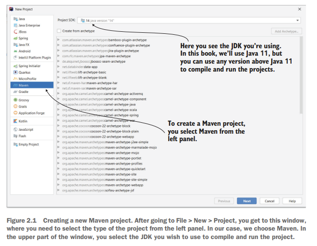

**Figure 2.1 Creating a new Maven project. After going to File \> New \> Project, you get to this window, where you need to select the type of the project from the left panel. In our case, we choose Maven. In the upper part of the window, you select the JDK you wish to use to compile and run the project.**
(**Hình 2.1 Tạo một dự án Maven mới. Sau khi vào File \> New \> Project, bạn sẽ đến cửa sổ này, nơi bạn cần chọn loại dự án ở bảng bên trái. Trong trường hợp của chúng ta, chúng ta chọn Maven. Ở phần trên của cửa sổ, bạn chọn JDK mà mình muốn dùng để biên dịch và chạy dự án.**)

Once you’ve selected the type of your project, in the next window
(Sau khi bạn đã chọn loại dự án, ở cửa sổ tiếp theo)
(figure 2.2) you need to give it a name. In addition to the project
((hình 2.2) bạn cần đặt tên cho nó. Ngoài tên dự án)
name and choosing the location in which to store it, for a Maven project you can also specify the following:
(và việc chọn vị trí để lưu trữ, đối với một dự án Maven bạn cũng có thể chỉ định các thông tin sau:)

- A group ID, which we use to group multiple related projects
(- Group ID, dùng để nhóm nhiều dự án có liên quan)

- An artifact ID, which is the name of the current application
(- Artifact ID, là tên của ứng dụng hiện tại)

- A version, which is an identifier of the current implementation state
(- Version, là định danh của trạng thái triển khai hiện tại)

**Optionally, you provide a group ID, an artifact ID, and a version. If you don’t configure these attributes, your IDE will use default values.**
(**Bạn có thể tùy chọn cung cấp group ID, artifact ID và version. Nếu bạn không cấu hình các thuộc tính này, IDE sẽ dùng các giá trị mặc định.**)

**You need to give a name to your project and store it somewhere in your computer.**
(**Bạn cần đặt tên cho dự án của mình và lưu nó ở đâu đó trên máy tính.**)

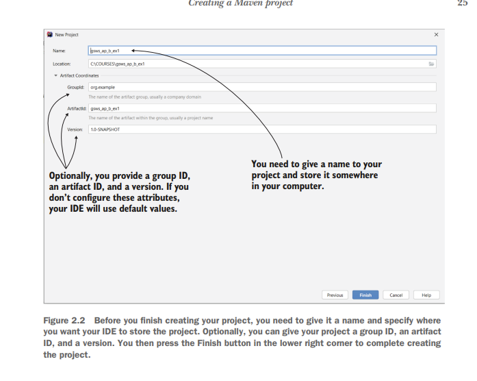

**Figure 2.2 Before you finish creating your project, you need to give it a name and specify where you want your IDE to store the project. Optionally, you can give your project a group ID, an artifact ID, and a version. You then press the Finish button in the lower right corner to complete creating the project.**
(**Hình 2.2 Trước khi hoàn tất việc tạo dự án, bạn cần đặt tên cho nó và chỉ định nơi bạn muốn IDE lưu dự án. Bạn cũng có thể tùy chọn cung cấp group ID, artifact ID và version cho dự án. Sau đó bạn nhấn nút Finish ở góc dưới bên phải để hoàn tất việc tạo dự án.**)

In a real-world app, these three attributes are essential details, and it’s important to provide them. But in our case, because we only work on theoretical examples, you can omit them and leave your IDE to fill in some default values for these characteristics.
(Trong một ứng dụng thực tế, ba thuộc tính này là những chi tiết quan trọng và cần được cung cấp đầy đủ. Nhưng trong trường hợp của chúng ta, vì chỉ làm việc với các ví dụ mang tính lý thuyết, bạn có thể bỏ qua chúng và để IDE tự điền một số giá trị mặc định cho các đặc điểm này.)

Once you’ve created the project, you’ll find its structure looks like the one pre-sented in figure 2.3. Again, the Maven project structure does not depend on the IDE you choose for developing your projects. When you look first at your project, you observe two main things:
(Sau khi đã tạo dự án, bạn sẽ thấy cấu trúc của nó giống như cấu trúc được trình bày trong hình 2.3. Một lần nữa, cấu trúc dự án Maven không phụ thuộc vào IDE mà bạn chọn để phát triển dự án. Khi nhìn vào dự án lần đầu, bạn sẽ nhận thấy hai điều chính:)

- The “src” folder (also known as the source folder), where you’ll put
(- Thư mục “src” (còn được gọi là source folder), nơi bạn đặt)
everything that belongs to the app.
(mọi thứ thuộc về ứng dụng.)

- The pom.xml file, where you write the configurations of your Maven
(- Tệp pom.xml, nơi bạn viết các cấu hình của dự án Maven)
project, like adding new dependencies.
(chẳng hạn như thêm các dependency mới.)

Maven organizes the “src” folder into the following folders:
(Maven tổ chức thư mục “src” thành các thư mục sau:)

- The “main” folder, where you store the application’s source code. This
(- Thư mục “main”, nơi bạn lưu mã nguồn của ứng dụng. Thư mục này)
folder contains the Java code and the configurations separately into two different sub-folders named “java” and “resources.”
(chứa mã Java và các cấu hình được tách riêng thành hai thư mục con khác nhau tên là “java” và “resources”.)

- The “test” folder, where you store the unit tests’ source code (we
(- Thư mục “test”, nơi bạn lưu mã nguồn của unit test (chúng ta)
discuss more about unit tests and how to define them in chapter 15).
(sẽ bàn kỹ hơn về unit test và cách định nghĩa chúng ở chương 15).)

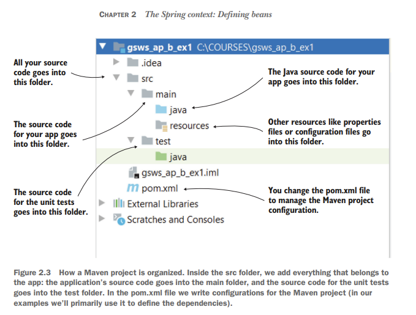

**All your source code goes into this folder.**
(**Toàn bộ mã nguồn của bạn nằm trong thư mục này.**)

**The source code for your app goes into this folder.**
(**Mã nguồn của ứng dụng của bạn nằm trong thư mục này.**)

**The source code for the unit tests**
(**Mã nguồn của các unit test**)

**goes into this folder.**
(**nằm trong thư mục này.**)

**The Java source code for your app goes into this folder.**
(**Mã nguồn Java của ứng dụng của bạn nằm trong thư mục này.**)

**Other resources like properties files or configuration files go into this folder.**
(**Các tài nguyên khác như tệp properties hoặc tệp cấu hình nằm trong thư mục này.**)

**You change the pom.xml file to manage the Maven project configuration.**
(**Bạn chỉnh sửa tệp pom.xml để quản lý cấu hình của dự án Maven.**)

**Figure 2.3 How a Maven project is organized. Inside the src folder, we add everything that belongs to the app: the application’s source code goes into the main folder, and the source code for the unit tests goes into the test folder. In the pom.xml file we write configurations for the Maven project (in our examples we’ll primarily use it to define the dependencies).**
(**Hình 2.3 Cách một dự án Maven được tổ chức. Bên trong thư mục src, chúng ta thêm mọi thứ thuộc về ứng dụng: mã nguồn của ứng dụng nằm trong thư mục main, còn mã nguồn của unit test nằm trong thư mục test. Trong tệp pom.xml, chúng ta viết các cấu hình cho dự án Maven (trong các ví dụ của mình, chúng ta chủ yếu dùng nó để định nghĩa dependency).**)

Figure 2.4 shows you how to add new source code to the “main/java” folder of the Maven project. New classes of the app go into this folder.
(Hình 2.4 cho bạn thấy cách thêm mã nguồn mới vào thư mục “main/java” của dự án Maven. Các class mới của ứng dụng sẽ nằm trong thư mục này.)

**Inside the “java” folder you create your usual Java packages and classes. Here, I’ve created**
(**Bên trong thư mục “java”, bạn tạo các package và class Java thông thường của mình. Ở đây, tôi đã tạo**)

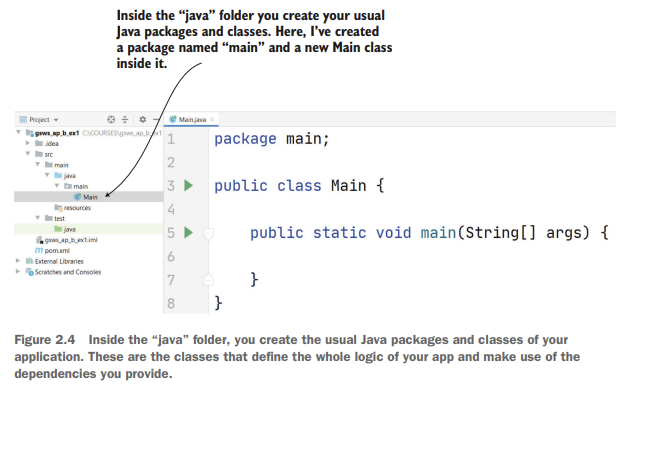

**a package named “main” and a new Main class inside it.**
(**một package tên là “main” và một class Main mới bên trong nó.**)

**Figure 2.4 Inside the “java” folder, you create the usual Java packages and classes of your application. These are the classes that define the whole logic of your app and make use of the dependencies you provide.**
(**Hình 2.4 Bên trong thư mục “java”, bạn tạo các package và class Java thông thường của ứng dụng. Đây là những class định nghĩa toàn bộ logic của ứng dụng và sử dụng các dependency mà bạn cung cấp.**)

In the projects we create in this book, we use plenty of external dependencies: libraries or frameworks we use to implement the functionality of the examples. To add these dependencies to your Maven projects, we need to change the content of the pom.xml file. In the following listing, you find the default content of the pom.xml file immediately after creating the Maven project.
(Trong các dự án mà chúng ta tạo trong cuốn sách này, chúng ta sử dụng khá nhiều dependency bên ngoài: các thư viện hoặc framework mà chúng ta dùng để triển khai chức năng của các ví dụ. Để thêm các dependency này vào dự án Maven của bạn, chúng ta cần thay đổi nội dung của tệp pom.xml. Trong listing sau, bạn sẽ thấy nội dung mặc định của tệp pom.xml ngay sau khi tạo dự án Maven.)

**Listing 2.1 The default content of the pom.xml file**
(**Listing 2.1 Nội dung mặc định của tệp pom.xml**)

```xml
<?xml version="1.0" encoding="UTF-8"?>

<project xmlns="http://maven.apache.org/POM/4.0.0"
         xmlns:xsi="http://www.w3.org/2001/XMLSchema-instance"
         xsi:schemaLocation="http://maven.apache.org/POM/4.0.0
                             http://maven.apache.org/xsd/maven-4.0.0.xsd">

    <modelVersion>4.0.0</modelVersion>

    <groupId>org.example</groupId>
    <artifactId>sq-ch2-ex1</artifactId>
    <version>1.0-SNAPSHOT</version>

</project>
```

With this pom.xml file, the project doesn’t use any external dependency. If you look in the project’s external dependencies folder, you should only see the JDK (figure 2.5).
(Với tệp pom.xml này, dự án không sử dụng bất kỳ dependency bên ngoài nào. Nếu bạn nhìn vào thư mục external dependencies của dự án, bạn chỉ nên thấy JDK (hình 2.5).)

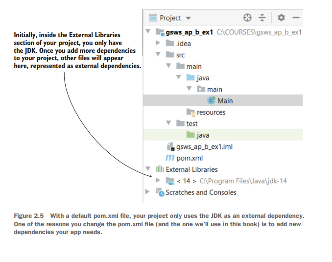

**Initially, inside the External Libraries section of your project, you only have**
(**Ban đầu, bên trong phần External Libraries của dự án, bạn chỉ có**)

**the JDK. Once you add more dependencies to your project, other files will appear**
(**JDK. Sau khi bạn thêm nhiều dependency hơn vào dự án, các tệp khác sẽ xuất hiện**)

**here, represented as external dependencies.**
(**ở đây, được biểu diễn dưới dạng các dependency bên ngoài.**)

**Figure 2.5 With a default pom.xml file, your project only uses the JDK as an external dependency. One of the reasons you change the pom.xml file (and the one we’ll use in this book) is to add new dependencies your app needs.**
(**Hình 2.5 Với một tệp pom.xml mặc định, dự án của bạn chỉ sử dụng JDK như một dependency bên ngoài. Một trong những lý do bạn thay đổi tệp pom.xml (và cũng là lý do chúng ta sẽ dùng trong cuốn sách này) là để thêm các dependency mới mà ứng dụng của bạn cần.**)

The following listing shows you how to add external dependencies to your project. You write all the dependencies between the \<dependencies\> \</dependencies\> tags. Each dependency is represented by a \<dependency\> \</dependency\> group of tags where you write the dependency’s attributes: the dependency’s group ID, artifact name, and version. Maven will search for the dependency by the values you provided for these three attributes and will download the dependencies from a repository. I won’t go into detail on how to configure a custom repository. You just need to be aware that Maven will download the dependencies (usually jar files) by default from a repository named the Maven central. You can find the downloaded jar files in your project’s external dependencies folder, as presented in figure 2.6.
(Listing sau cho bạn thấy cách thêm dependency bên ngoài vào dự án. Bạn viết tất cả các dependency nằm giữa hai thẻ \<dependencies\> và \</dependencies\>. Mỗi dependency được biểu diễn bằng một nhóm thẻ \<dependency\> và \</dependency\>, nơi bạn viết các thuộc tính của dependency: group ID, artifact name và version của dependency đó. Maven sẽ tìm kiếm dependency dựa trên các giá trị bạn cung cấp cho ba thuộc tính này và sẽ tải các dependency từ một repository. Tôi sẽ không đi sâu vào cách cấu hình một repository tùy chỉnh. Bạn chỉ cần biết rằng Maven mặc định sẽ tải các dependency (thường là các tệp jar) từ một repository có tên là Maven Central. Bạn có thể tìm thấy các tệp jar đã tải xuống trong thư mục external dependencies của dự án, như được trình bày trong hình 2.6.)

**Listing 2.2 Adding a new dependency in the pom.xml file**
(**Listing 2.2 Thêm một dependency mới vào tệp pom.xml**)

**You need to write the dependencies for the project between the \<dependencies\> and**
(**Bạn cần viết các dependency của dự án nằm giữa thẻ \<dependencies\> và**)

**\</dependecies\> tags.**
(**thẻ \</dependencies\>.**)

```xml
<?xml version="1.0" encoding="UTF-8"?>

<project xmlns="http://maven.apache.org/POM/4.0.0"
         xmlns:xsi="http://www.w3.org/2001/XMLSchema-instance"
         xsi:schemaLocation="http://maven.apache.org/POM/4.0.0
                             http://maven.apache.org/xsd/maven-4.0.0.xsd">

    <modelVersion>4.0.0</modelVersion>

    <groupId>org.example</groupId>
    <artifactId>sq_ch2_ex1</artifactId>
    <version>1.0-SNAPSHOT</version>

    <dependencies>
        <dependency>
            <groupId>org.springframework</groupId>
            <artifactId>spring-jdbc</artifactId>
            <version>5.2.6.RELEASE</version>
        </dependency>
    </dependencies>

</project>
```

**A dependency is represented by a group of \<dependency\>**
(**Một dependency được biểu diễn bằng một nhóm thẻ \<dependency\>**)

**\</dependency\> tags.**
(**và \</dependency\>.**)

Once you’ve added the dependency in the pom.xml file, as presented in the previous listing, the IDE downloads them, and you’ll now find these dependencies in the “External Libraries” folder (figure 2.6).
(Sau khi bạn đã thêm phần phụ thuộc vào tệp pom.xml, như được trình bày trong danh sách trước đó, IDE sẽ tải chúng xuống và bây giờ bạn sẽ tìm thấy những phần phụ thuộc này trong thư mục “Thư viện bên ngoài” (hình 2.6).)

Now we can move to the next section, where we discuss the basics of the Spring context. You’ll create Maven projects, and you’ll learn to use a Spring dependency named spring-context, to manage the Spring context.
(Bây giờ chúng ta có thể chuyển sang phần tiếp theo, nơi chúng ta thảo luận về những điều cơ bản của Spring context. Bạn sẽ tạo các dự án Maven, và bạn sẽ học cách sử dụng một dependency của Spring có tên là spring-context để quản lý Spring context.)

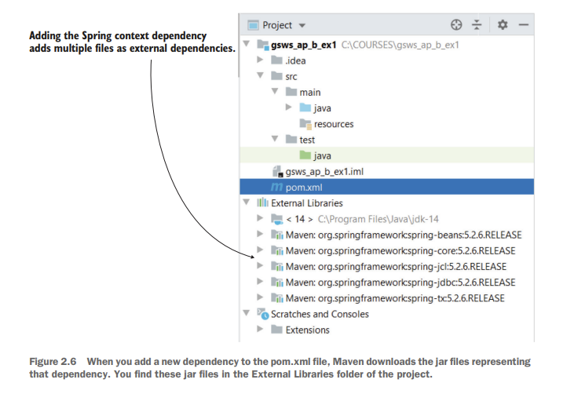

**Adding the Spring context dependency**
(**Việc thêm dependency Spring context**)

**adds multiple files as external dependencies.**
(**sẽ thêm nhiều tệp dưới dạng các dependency bên ngoài.**)

**Figure 2.6 When you add a new dependency to the pom.xml file, Maven downloads the jar files representing that dependency. You find these jar files in the External Libraries folder of the project.**
(**Hình 2.6 Khi bạn thêm một dependency mới vào tệp pom.xml, Maven sẽ tải xuống các tệp jar đại diện cho dependency đó. Bạn sẽ tìm thấy các tệp jar này trong thư mục External Libraries của dự án.**)

## Adding new beans to the Spring context
## Thêm các bean mới vào Spring context

In this section, you’ll learn how to add new object instances (i.e., beans) to the Spring context. You’ll find out that you have multiple ways to add beans in the Spring context such that Spring can manage them and plug features it provides into your app. Depending on the action, you’ll choose a specific way to add the bean; we’ll discuss when to select one or another. You can add beans in the context in the following ways (which we’ll describe later in this chapter):
(Trong phần này, bạn sẽ học cách thêm các đối tượng mới (tức là bean) vào Spring context. Bạn sẽ thấy rằng có nhiều cách để thêm bean vào Spring context, để Spring có thể quản lý chúng và gắn các tính năng mà nó cung cấp vào ứng dụng của bạn. Tùy theo hành động cần thực hiện, bạn sẽ chọn một cách cụ thể để thêm bean; chúng ta sẽ thảo luận khi nào nên chọn cách này hoặc cách kia. Bạn có thể thêm bean vào context theo các cách sau (chúng ta sẽ mô tả chi tiết hơn ở phần sau của chương này):)

* Using the @Bean annotation
  (- Sử dụng annotation @Bean)

* Using stereotype annotations
  (- Sử dụng stereotype annotation)

* Programmatically
  (- Thêm theo cách lập trình trực tiếp)

Let’s first create a project with a reference to no framework—not even Spring. We’ll then add the dependencies needed to use the Spring context and create it (figure 2.7). This example will serve as a prerequisite to adding beans to the Spring context examples that we’re going to work on in sections 2.2.1 through 2.2.3.
(Trước tiên, hãy tạo một dự án không tham chiếu tới bất kỳ framework nào — thậm chí chưa có Spring. Sau đó chúng ta sẽ thêm các dependency cần thiết để sử dụng Spring context và tạo nó (hình 2.7). Ví dụ này sẽ đóng vai trò như phần chuẩn bị bắt buộc cho các ví dụ thêm bean vào Spring context mà chúng ta sẽ làm trong các phần 2.2.1 đến 2.2.3.)

We create a Maven project and define a class. Because it’s funny to imagine, I’ll consider a class named Parrot with only a String attribute representing the name of the parrot (listing 2.3). Remember, in this chapter, we only focus on adding beans to the Spring context, so it’s okay to use any object that helps you better remember the
(Chúng ta tạo một dự án Maven và định nghĩa một class. Vì tưởng tượng như vậy khá vui, tôi sẽ dùng một class tên là Parrot, chỉ có một thuộc tính kiểu String đại diện cho tên của con vẹt (listing 2.3). Hãy nhớ rằng trong chương này, chúng ta chỉ tập trung vào việc thêm bean vào Spring context, vì vậy bạn có thể dùng bất kỳ đối tượng nào giúp bạn dễ nhớ cú pháp hơn.)

**What you want to achieve**
(**Điều bạn muốn đạt được**)

**We’ll start by independently creating an object of the type Parrot and the Spring context.**
(**Chúng ta sẽ bắt đầu bằng cách tạo riêng một đối tượng kiểu Parrot và Spring context.**)

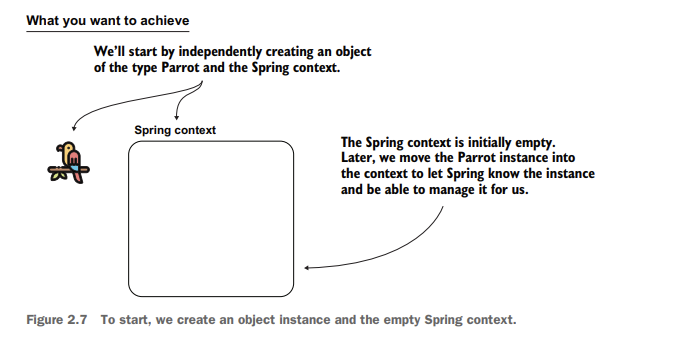

**The Spring context is initially empty.**
(**Ban đầu Spring context là rỗng.**)

**Later, we move the Parrot instance into the context to let Spring know the instance and be able to manage it for us.**
(**Sau đó, chúng ta đưa đối tượng Parrot vào context để Spring biết đến đối tượng này và có thể quản lý nó cho chúng ta.**)

**Figure 2.7 To start, we create an object instance and the empty Spring context.**
(**Hình 2.7 Để bắt đầu, chúng ta tạo một đối tượng và một Spring context rỗng.**)

syntaxes. You find the code for this example in the project “sq-ch2-ex1” (you can download the projects from the “Resources” section of the live book). For your proj-ect, you can use the same name or choose the one you prefer.
(Bạn có thể tìm thấy mã của ví dụ này trong dự án “sq-ch2-ex1” (bạn có thể tải các dự án từ phần “Resources” của live book). Với dự án của mình, bạn có thể dùng cùng tên đó hoặc chọn một tên bạn thích.)

**Listing 2.3 The Parrot class**
(**Listing 2.3 Class Parrot**)

```java
public class Parrot {
    private String name;

    // Omitted getters and setters
}
```

You can now define a class containing the main method and create an instance of the class Parrot, as presented in the following listing. I usually name this class Main.
(Bây giờ bạn có thể định nghĩa một class chứa phương thức main và tạo một đối tượng của class Parrot, như được trình bày trong listing sau. Tôi thường đặt tên class này là Main.)

**Listing 2.4 Creating an instance of the Parrot class**
(**Listing 2.4 Tạo một đối tượng của class Parrot**)

```java
public class Main {

    public static void main(String[] args) {
        Parrot p = new Parrot();
    }
}
```

It’s now time to add the needed dependencies to our project. Because we’re using Maven, I’ll add the dependencies in the pom.xml file, as presented in the following listing.
(Bây giờ là lúc thêm các dependency cần thiết vào dự án. Vì chúng ta đang dùng Maven, tôi sẽ thêm các dependency vào tệp pom.xml, như được trình bày trong listing sau.)

**Listing 2.5 Adding the dependency for Spring context**
(**Listing 2.5 Thêm dependency cho Spring context**)

```xml
<project xmlns="http://maven.apache.org/POM/4.0.0"
         xmlns:xsi="http://www.w3.org/2001/XMLSchema-instance"
         xsi:schemaLocation="http://maven.apache.org/POM/4.0.0
                             http://maven.apache.org/xsd/maven-4.0.0.xsd">

    <modelVersion>4.0.0</modelVersion>

    <groupId>org.example</groupId>
    <artifactId>sq-ch2-ex1</artifactId>
    <version>1.0-SNAPSHOT</version>

    <dependencies>
        <dependency>
            <groupId>org.springframework</groupId>
            <artifactId>spring-context</artifactId>
            <version>5.2.6.RELEASE</version>
        </dependency>
    </dependencies>

</project>
```

A critical thing to observe is that Spring is designed to be modular. By modular, I mean that you don’t need to add the whole Spring to your app when you use some-thing out of the Spring ecosystem. You just need to add those parts that you use. For this reason, in listing 2.5, you see that I’ve only added the spring-context depen-dency, which instructs Maven to pull the needed dependencies for us to use the Spring context. Throughout the book, we’ll add various dependencies to our projects according to what we implement, but we’ll always only add what we need.
(Một điều quan trọng cần chú ý là Spring được thiết kế theo kiểu module hóa. Khi nói module hóa, ý tôi là bạn không cần thêm toàn bộ Spring vào ứng dụng khi bạn chỉ dùng một thứ nào đó trong hệ sinh thái Spring. Bạn chỉ cần thêm những phần mà bạn sử dụng. Vì lý do này, trong listing 2.5, bạn thấy rằng tôi chỉ thêm dependency spring-context, dependency này yêu cầu Maven kéo về các dependency cần thiết để chúng ta sử dụng Spring context. Xuyên suốt cuốn sách, chúng ta sẽ thêm nhiều dependency khác nhau vào các dự án tùy theo thứ mình triển khai, nhưng chúng ta sẽ luôn chỉ thêm những gì mình cần.)

**NOTE** You might wonder how I knew which Maven dependency I should
(**LƯU Ý** Bạn có thể thắc mắc làm sao tôi biết mình nên phụ thuộc vào Maven nào)
add. The truth is that I’ve used them so many times I know them by heart. How-ever, you don’t need to memorize them. Whenever you work with a new Spring project, you can search for the dependencies you need to add directly in the Spring reference
([https://docs.spring.io/spring-framework/docs/](https://docs.spring.io/spring-framework/docs/current/spring-framework-reference/core.html)
[current/spring-framework-reference/core.html](https://docs.spring.io/spring-framework/docs/current/spring-framework-reference/core.html)). Generally, Spring depen-dencies are part of the org.springframework group ID.
([current/spring-framework-reference/core.html](https://docs.spring.io/spring-framework/docs/current/spring-framework-reference/core.html)). Nói chung, các phần phụ thuộc của Spring là một phần của ID nhóm org.springframework.)

With the dependency added to our project, we can create an instance of the Spring context. In the next listing, you can see how I’ve changed the main method to create the Spring context instance.
(Sau khi đã thêm dependency vào dự án, chúng ta có thể tạo một đối tượng Spring context. Trong listing tiếp theo, bạn có thể thấy cách tôi thay đổi phương thức main để tạo đối tượng Spring context.)

**Listing 2.6 Creating the instance of the Spring context**
(**Listing 2.6 Tạo đối tượng Spring context**)

**Creates an instance of the Spring context**
(**Tạo một đối tượng Spring context**)

```java
public class Main {

    public static void main(String[] args) {
        var context = new AnnotationConfigApplicationContext();
        Parrot p = new Parrot();
    }
}
```

**NOTE** We use the AnnotationConfigApplicationContext class to create
(**LƯU Ý** Chúng ta sử dụng class AnnotationConfigApplicationContext để tạo)
the Spring context instance. Spring offers multiple implementations. Because in most cases you’ll use the AnnotationConfigApplicationContext class (the implementation that uses the most used today’s approach: annotations), we’ll focus on this one in this book. Also, I only tell you what you need to know for the current discussion. If you’re just getting started with Spring, my recom-mendation is to avoid getting into details with context implementations and these classes’ inheritance chains. Chances are that if you do you’ll get lost with unimportant details instead of focusing on the essential things.
(đối tượng Spring context. Spring cung cấp nhiều implementation khác nhau. Vì trong hầu hết các trường hợp bạn sẽ dùng class AnnotationConfigApplicationContext (implementation sử dụng cách tiếp cận phổ biến nhất hiện nay: annotation), nên trong cuốn sách này chúng ta sẽ tập trung vào class này. Ngoài ra, tôi chỉ nói với bạn những gì bạn cần biết cho phần thảo luận hiện tại. Nếu bạn mới bắt đầu với Spring, tôi khuyên bạn nên tránh đi quá sâu vào chi tiết của các implementation context và chuỗi kế thừa của các class này. Rất có khả năng nếu bạn làm vậy, bạn sẽ bị lạc vào những chi tiết không quan trọng thay vì tập trung vào những điều cốt lõi.)

As presented in figure 2.8, you created an instance of Parrot, added the Spring con-text dependencies to your project, and created an instance of the Spring context. Your objective is to add the Parrot object to the context, which is the next step.
(Như được trình bày trong hình 2.8, bạn đã tạo một phiên bản của Parrot, thêm các phụ thuộc văn bản ngữ cảnh Spring vào dự án của bạn và tạo một phiên bản của ngữ cảnh Spring. Mục tiêu của bạn là thêm đối tượng Parrot vào ngữ cảnh, đây là bước tiếp theo.)

**What you did**
(**Bạn đã làm gì**)

**You created a parrot instance, but it’s not in the Spring context.**
(**Bạn đã tạo một phiên bản vẹt nhưng nó không có trong ngữ cảnh Mùa xuân.**)

**What you want to achieve**
(**Điều bạn mong muốn đạt được**)

**Adding the parrot instance in the Spring context will allow Spring to “see” the instance.**
(**Việc thêm phiên bản vẹt vào ngữ cảnh Spring sẽ cho phép Spring “nhìn thấy” phiên bản đó.**)

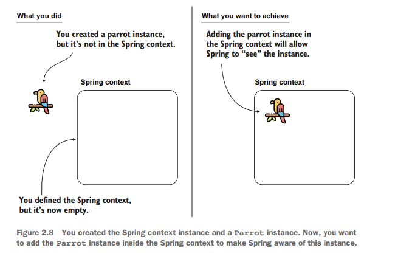

**Spring context**

**You defined the Spring context, but it’s now empty.**
(**Bạn đã xác định bối cảnh Spring nhưng hiện tại nó trống.**)

**Figure 2.8 You created the Spring context instance and a Parrot instance. Now, you want to add the Parrot instance inside the Spring context to make Spring aware of this instance.**
(**Hình 2.8 Bạn đã tạo phiên bản ngữ cảnh Spring và phiên bản Parrot. Bây giờ, bạn muốn thêm phiên bản Parrot vào trong ngữ cảnh Spring để Spring nhận biết phiên bản này.**)

We just finished creating the prerequisite (skeleton) project, which we’ll use in the next sections to understand how to add beans to the Spring context. In section 2.2.1, we continue learning how to add the instance to the Spring context using the @Bean annotation. Further, in sections 2.2.2 and 2.2.3, you’ll also learn the alternatives of adding the instance using stereotype annotations and doing it programmatically. After discussing all three approaches, we’ll compare them, and you’ll learn the best circum-stances for using each.
(Chúng tôi vừa hoàn thành việc tạo dự án tiên quyết (khung) mà chúng tôi sẽ sử dụng trong các phần tiếp theo để hiểu cách thêm đậu vào ngữ cảnh Mùa xuân. Trong phần 2.2.1, chúng ta tiếp tục tìm hiểu cách thêm phiên bản vào ngữ cảnh Spring bằng chú thích @Bean. Hơn nữa, trong phần 2.2.2 và 2.2.3, bạn cũng sẽ tìm hiểu các lựa chọn thay thế cho việc thêm phiên bản bằng cách sử dụng chú thích khuôn mẫu và thực hiện việc đó theo chương trình. Sau khi thảo luận về cả ba cách tiếp cận, chúng tôi sẽ so sánh chúng và bạn sẽ tìm hiểu những trường hợp tốt nhất để sử dụng từng cách.)

### Using the @Bean annotation to add beans into the Spring context
### ### Sử dụng chú thích @Bean để thêm đậu vào ngữ cảnh Spring

In this section, we’ll discuss adding an object instance to the Spring context using the @Bean annotation. This makes it possible for you to add the instances of the classes defined in your project (like Parrot in our case), as well as classes you didn’t create yourself but you use in your app. I believe this approach is the easiest to understand when starting out. Remember that the reason you learn to add beans to the Spring con-text is that Spring can manage only the objects that are part of it. First, I’ll give you a straightforward example of how to add a bean to the Spring context using the @Bean annotation. Then I’ll show you how to add multiple beans of the same or different type.
(Trong phần này, chúng ta sẽ thảo luận về việc thêm một phiên bản đối tượng vào ngữ cảnh Spring bằng cách sử dụng chú thích @Bean. Điều này giúp bạn có thể thêm phiên bản của các lớp được xác định trong dự án của mình (như Parrot trong trường hợp của chúng tôi), cũng như các lớp bạn không tự tạo nhưng bạn sử dụng trong ứng dụng của mình. Tôi tin rằng cách tiếp cận này là dễ hiểu nhất khi bắt đầu. Hãy nhớ rằng lý do bạn học cách thêm đậu vào ngữ cảnh Spring là vì Spring chỉ có thể quản lý các đối tượng là một phần của nó. Đầu tiên, tôi sẽ cho bạn một ví dụ đơn giản về cách thêm một Bean vào ngữ cảnh Spring bằng cách sử dụng chú thích @Bean. Sau đó, tôi sẽ chỉ cho bạn cách thêm nhiều loại đậu cùng loại hoặc khác loại.)

The steps you need to follow to add a bean to the Spring context using the @Bean
(Các bước bạn cần thực hiện để thêm Bean vào ngữ cảnh Spring bằng cách sử dụng @Bean)

annotation are as follows (figure 2.9):
(chú thích như sau (hình 2.9):)

**1** Define a configuration class (annotated with @Configuration) for your project, which, as we’ll discuss later, we use to configure the context of Spring.
(**1** Xác định lớp cấu hình (được chú thích bằng @Configuration) cho dự án của bạn, như chúng ta sẽ thảo luận sau, chúng ta sử dụng lớp này để định cấu hình ngữ cảnh của Spring.)

**2** Add a method to the configuration class that returns the object instance you want to add to the context and annotate the method with the @Bean annotation.
(**2** Thêm một phương thức vào lớp cấu hình để trả về phiên bản đối tượng mà bạn muốn thêm vào ngữ cảnh và chú thích phương thức đó bằng chú thích @Bean.)

**3** Make Spring use the configuration class defined in step 1. As you’ll learn later, we use configuration classes to write different configurations for the framework.
(**3** Làm cho Spring sử dụng lớp cấu hình được xác định ở bước 1. Như bạn sẽ tìm hiểu sau, chúng tôi sử dụng các lớp cấu hình để viết các cấu hình khác nhau cho khung.)

Let’s follow these steps and apply them in the project named “sq-c2-ex2.” To keep all the steps we discuss separated, I recommend you create new projects for each example.
(Hãy làm theo các bước sau và áp dụng chúng trong dự án có tên “sq-c2-ex2”. Để tách biệt tất cả các bước chúng ta thảo luận, tôi khuyên bạn nên tạo dự án mới cho mỗi ví dụ.)

**NOTE** Remember, you can find the book’s projects in the “Resources”
(**LƯU Ý** Hãy nhớ rằng, bạn có thể tìm thấy các dự án của cuốn sách trong phần “Tài nguyên”)
sec-tion of the live book.
(phần của cuốn sách trực tiếp.)

@**Configuration**
(@**Cấu hình**)

public class ProjectConfig {

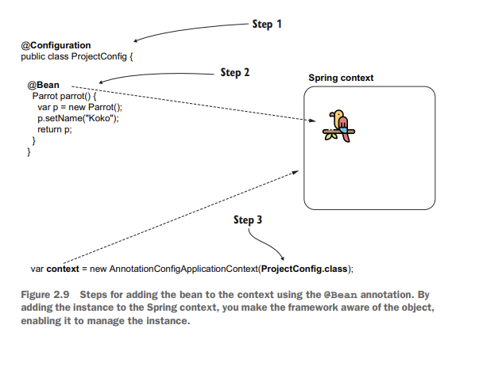

@**Bean**

Parrot parrot() {

var p = new Parrot(); p.setName("Koko"); return p;

**Step 2**
(**Bước 2**)

**Step 1**
(**Bước 1**)

**Spring context**
(**Bối cảnh mùa xuân**)

}

}

**Step 3**
(**Bước 3**)

var **context** = new AnnotationConfigApplicationContext(**ProjectConfig.class**);

**Figure 2.9 Steps for adding the bean to the context using the @Bean annotation. By adding the instance to the Spring context, you make the framework aware of the object, enabling it to manage the instance.**
(**Hình 2.9 Các bước thêm đậu vào ngữ cảnh bằng chú thích @Bean. Bằng cách thêm phiên bản vào ngữ cảnh Spring, bạn làm cho khung nhận thức được đối tượng, cho phép khung quản lý phiên bản đó.**)

**NOTE** A configuration class is a special class in Spring
(**LƯU Ý** Lớp cấu hình là một lớp đặc biệt trong Spring)
applications that we use to instruct Spring to do specific actions. For example, we can tell Spring to cre-ate beans or to enable certain functionalities. You will learn different things you can define in configuration classes throughout the rest of the book.
(các ứng dụng mà chúng ta sử dụng để hướng dẫn Spring thực hiện các hành động cụ thể. Ví dụ: chúng ta có thể yêu cầu Spring tạo các Bean hoặc kích hoạt một số chức năng nhất định. Bạn sẽ học được những điều khác nhau mà bạn có thể định nghĩa trong các lớp cấu hình trong suốt phần còn lại của cuốn sách.)

**Step** **1: Defining a configuration class in your project**
(**Bước** **1: Xác định lớp cấu hình trong dự án của bạn**)

The first step is to create a configuration class in the project. A Spring configuration class is characterized by the fact that it is annotated with the @Configuration annota-tion. We use the configuration classes to define various Spring-related configurations for the project. Throughout the book, you’ll learn different things you can configure using the configuration classes. For the moment we focus only on adding new instances to the Spring context. The next listing shows you how to define the configu-ration class. I named this configuration class ProjectConfig.
(Bước đầu tiên là tạo một lớp cấu hình trong dự án. Lớp cấu hình Spring được đặc trưng bởi thực tế là nó được chú thích bằng chú thích @Configuration. Chúng tôi sử dụng các lớp cấu hình để xác định các cấu hình khác nhau liên quan đến Spring cho dự án. Xuyên suốt cuốn sách, bạn sẽ học được những điều khác nhau mà bạn có thể cấu hình bằng cách sử dụng các lớp cấu hình. Hiện tại, chúng tôi chỉ tập trung vào việc thêm các phiên bản mới vào ngữ cảnh Spring. Danh sách tiếp theo chỉ cho bạn cách xác định lớp configu-ration. Tôi đặt tên lớp cấu hình này là ProjectConfig.)

**Listing 2.7 Defining a configuration class for the project**
(**Listing 2.7 Định nghĩa một class cấu hình cho dự án**)

```java
@Configuration
public class ProjectConfig {

}
```

**We use the @Configuration annotation to define this class as a Spring configuration class.**
(**Chúng ta sử dụng annotation @Configuration để định nghĩa class này là một class cấu hình của Spring.**)

**NOTE** I separate the classes into different packages to make the
(**LƯU Ý** Tôi tách các lớp thành các gói khác nhau để tạo)
code easier to understand. For example, I create the configuration classes in a package named config, and the Main class in a package named main. Organizing the classes into packages is a good practice; I recommend you follow it in your real-world implementations as well.
(mã dễ hiểu hơn. Ví dụ: tôi tạo các lớp cấu hình trong gói có tên config và lớp Main trong gói có tên main. Việc tổ chức các lớp học thành các gói là một cách làm tốt; Tôi khuyên bạn cũng nên làm theo nó trong quá trình triển khai trong thế giới thực của mình.)

**Step** **2: Create a method that returns the bean, and annotate the method with @Bean**
(**Bước** **2: Tạo một phương thức trả về đậu và chú thích phương thức đó bằng @Bean**)

One of the things you can do with a configuration class is add beans to the Spring con-text. To do this, we need to define a method that returns the object instance we wish to add to the context and annotate that method with the @Bean annotation, which lets Spring know that it needs to call this method when it initializes its context and adds the returned value to the context. The next listing shows the changes to the configura-tion class to implement the current step.
(Một trong những điều bạn có thể làm với lớp cấu hình là thêm đậu vào ngữ cảnh Spring. Để làm điều này, chúng ta cần xác định một phương thức trả về thể hiện đối tượng mà chúng ta muốn thêm vào ngữ cảnh và chú thích phương thức đó bằng chú thích @Bean, điều này cho phép Spring biết rằng nó cần gọi phương thức này khi khởi tạo ngữ cảnh và thêm giá trị trả về vào ngữ cảnh. Danh sách tiếp theo hiển thị những thay đổi đối với lớp cấu hình để triển khai bước hiện tại.)

**NOTE** For the projects in this book, I use Java 11: the latest
(**LƯU Ý** Đối với các dự án trong cuốn sách này, tôi sử dụng Java 11: phiên bản mới nhất)
long-term sup-ported Java version. More and more projects are adopting this version. Gener-ally, the only specific feature I use in the code snippets that doesn’t work with an earlier version of Java is the var reserved type name. I use var here and there to make the code shorter and easier to read, but if you’d like to use an earlier version of Java (say Java 8, for example), you can replace var with the inferred type. This way, you’ll make the projects work with Java 8 as well.
(phiên bản Java được hỗ trợ lâu dài. Ngày càng có nhiều dự án áp dụng phiên bản này. Nhìn chung, tính năng cụ thể duy nhất tôi sử dụng trong các đoạn mã không hoạt động với phiên bản Java cũ hơn là tên loại dành riêng cho var. Tôi sử dụng var ở đây và ở đó để làm cho mã ngắn hơn và dễ đọc hơn, nhưng nếu bạn muốn sử dụng phiên bản Java cũ hơn (ví dụ: Java 8), bạn có thể thay thế var bằng loại được suy ra. Bằng cách này, bạn cũng sẽ làm cho các dự án hoạt động với Java 8.)

**Listing 2.8 Defining the @Bean method**
(**Listing 2.8 Định nghĩa method @Bean**)

**By adding the @Bean annotation, we instruct Spring to call this method when at context initialization and add the returned value to the context.**
(**Bằng cách thêm annotation @Bean, chúng ta chỉ dẫn Spring gọi method này khi khởi tạo context và thêm giá trị được trả về vào context.**)

**Set a name for the parrot we’ll use later when we test the app.**
(**Đặt tên cho con vẹt mà chúng ta sẽ dùng sau này khi kiểm thử ứng dụng.**)

**Spring adds to its context the Parrot instance returned by the method.**
(**Spring thêm vào context của nó đối tượng Parrot được method trả về.**)

```java
@Configuration
public class ProjectConfig {

    @Bean
    Parrot parrot() {
        var p = new Parrot();
        p.setName("Koko");
        return p;
    }
}
```

Observe that the name I used for the method doesn’t contain a verb. You probably learned that a Java best practice is to put verbs in method names because the methods generally represent actions. But for methods we use to add beans in the Spring con-text, we don’t follow this convention. Such methods represent the object instances they return and that will now be part of the Spring context. The method’s name also becomes the bean’s name (as in listing 2.8, the bean’s name is now “parrot”). By con-vention, you can use nouns, and most often they have the same name as the class.
(Lưu ý rằng tên tôi sử dụng cho phương thức không chứa động từ. Bạn có thể đã biết rằng cách tốt nhất trong Java là đặt động từ vào tên phương thức vì các phương thức này thường biểu thị các hành động. Nhưng đối với các phương pháp chúng tôi sử dụng để thêm đậu vào ngữ cảnh Mùa xuân, chúng tôi không tuân theo quy ước này. Các phương thức như vậy đại diện cho các thể hiện đối tượng mà chúng trả về và giờ đây sẽ là một phần của bối cảnh Spring. Tên của phương thức cũng trở thành tên của đậu (như trong danh sách 2.8, tên của đậu bây giờ là “con vẹt”). Theo quy ước, bạn có thể sử dụng danh từ và hầu hết chúng thường có cùng tên với lớp.)

**Step 3****: Make Spring initialize its context using the newly created configuration class**
(**Bước 3****: Tạo Spring khởi tạo bối cảnh của nó bằng lớp cấu hình mới được tạo**)

We’ve implemented a configuration class in which we tell Spring the object instance that needs to become a bean. Now we need to make sure Spring uses this configura-tion class when initializing its context. The next listing shows you how to change the instantiation of the Spring context in the main class to use the configuration class we implemented in the first two steps.
(Chúng tôi đã triển khai một lớp cấu hình trong đó chúng tôi thông báo cho Spring phiên bản đối tượng cần trở thành một Bean. Bây giờ chúng ta cần đảm bảo Spring sử dụng lớp cấu hình này khi khởi tạo ngữ cảnh của nó. Danh sách tiếp theo chỉ cho bạn cách thay đổi cách khởi tạo ngữ cảnh Spring trong lớp chính để sử dụng lớp cấu hình mà chúng tôi đã triển khai trong hai bước đầu tiên.)

**Listing 2.9 Initializing the Spring context based on the defined configuration class**
(**Listing 2.9 Khởi tạo Spring context dựa trên class cấu hình đã định nghĩa**)

**When creating the Spring context instance, send the configuration class as a parameter to instruct Spring to use it.**
(**Khi tạo đối tượng Spring context, hãy truyền class cấu hình như một tham số để chỉ dẫn Spring sử dụng nó.**)

```java
public class Main {

    public static void main(String[] args) {
        var context =
                new AnnotationConfigApplicationContext(ProjectConfig.class);
    }
}
```

To verify the Parrot instance is indeed part of the context now, you can refer to the instance and print its name in the console, as presented in the following listing.
(Để xác minh phiên bản Parrot thực sự là một phần của ngữ cảnh, bạn có thể tham khảo phiên bản đó và in tên của nó trong bảng điều khiển, như được trình bày trong danh sách sau đây.)

**Listing 2.10 Referring to the Parrot instance from the context**
(**Listing 2.10 Tham chiếu đến đối tượng Parrot từ context**)

**Gets a reference of a bean of type Parrot from the Spring context**
(**Lấy một tham chiếu tới một bean kiểu Parrot từ Spring context**)

```java
public class Main {

    public static void main(String[] args) {
        var context =
                new AnnotationConfigApplicationContext(ProjectConfig.class);

        Parrot p = context.getBean(Parrot.class);

        System.out.println(p.getName());
    }
}
```

Now you’ll see the name you gave to the parrot you added in the context in the con-sole, in my case Koko.
(Bây giờ bạn sẽ thấy tên bạn đặt cho con vẹt mà bạn đã thêm trong ngữ cảnh trên bảng điều khiển, trong trường hợp của tôi là Koko.)

**NOTE** In real-world scenarios, we use unit and integration tests to
(**LƯU Ý** Trong các tình huống thực tế, chúng tôi sử dụng các thử nghiệm đơn vị và tích hợp để)
validate that our implementations work as desired. The projects in this book imple-ment unit tests to validate the discussed behavior. Because this is a “getting started” book, you might not yet be aware of unit tests. To avoid creating con-fusion and allow you to focus on the discussed subject, we won’t discuss unit tests until chapter 15. However, if you already know how to write unit tests and reading them helps you better understand the subject, you can find all the unit tests implemented in the test folder of each of our Maven projects. If you don’t yet know how unit tests work, I recommend focusing only on the discussed subject.
(xác thực rằng việc triển khai của chúng tôi hoạt động như mong muốn. Các dự án trong cuốn sách này thực hiện các bài kiểm tra đơn vị để xác nhận hành vi được thảo luận. Vì đây là cuốn sách “bắt đầu” nên có thể bạn chưa biết về các bài kiểm tra đơn vị. Để tránh tạo ra sự nhầm lẫn và cho phép bạn tập trung vào chủ đề được thảo luận, chúng ta sẽ không thảo luận về bài kiểm thử đơn vị cho đến chương 15. Tuy nhiên, nếu bạn đã biết cách viết bài kiểm thử đơn vị và việc đọc chúng sẽ giúp bạn hiểu rõ hơn về chủ đề, bạn có thể tìm thấy tất cả các bài kiểm thử đơn vị được triển khai trong thư mục kiểm tra của từng dự án Maven của chúng tôi. Nếu bạn chưa biết cách hoạt động của bài kiểm tra đơn vị, tôi khuyên bạn chỉ nên tập trung vào chủ đề đã thảo luận.)

As in the previous example, you can add any kind of object to the Spring context (fig-ure 2.10). Let’s also add a String and an Integer and see that it’s working.
(Như trong ví dụ trước, bạn có thể thêm bất kỳ loại đối tượng nào vào bối cảnh Spring (hình 2.10). Chúng ta cũng hãy thêm Chuỗi và Số nguyên và xem nó có hoạt động không.)

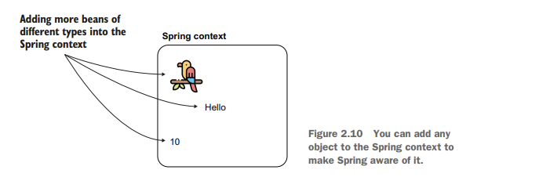

**Adding more beans of different types into the Spring context**
(**Thêm nhiều loại đậu khác nhau vào bối cảnh Mùa xuân**)

**Spring context**
(**Bối cảnh mùa xuân**)

Hello
(Xin chào)

10
(10)

**Figure 2.10 You can add any object to the Spring context to make Spring aware of it.**
(**Hình 2.10 Bạn có thể thêm bất kỳ đối tượng nào vào bối cảnh Spring để Spring nhận biết được nó.**)

The next listing shows you how I changed the configuration class to also add a bean of type String and a bean of type Integer.
(Danh sách tiếp theo cho bạn thấy cách tôi thay đổi lớp cấu hình để thêm một Bean kiểu String và một Bean kiểu Integer.)

**Listing 2.11 Adding two more beans to the context**
(**Listing 2.11 Thêm hai bean nữa vào context**)

**Adds the string “Hello” to the Spring context**
(**Thêm chuỗi “Hello” vào Spring context**)

**Adds the integer 10 to the Spring context**
(**Thêm số nguyên 10 vào Spring context**)

```java
@Configuration
public class ProjectConfig {

    @Bean
    Parrot parrot() {
        var p = new Parrot();
        p.setName("Koko");
        return p;
    }

    @Bean
    String hello() {
        return "Hello";
    }

    @Bean
    Integer ten() {
        return 10;
    }
}
```

**NOTE** Remember the Spring context’s purpose: we add the instances
(**LƯU Ý** Hãy nhớ mục đích của bối cảnh Mùa xuân: chúng tôi thêm các phiên bản)
we expect Spring needs to manage. (This way, we plug in functionalities offered by the framework.) In a real-world app, we won’t add every object to the Spring context. Starting with chapter 4, when our examples will become closer to code in a production-ready app, we’ll also focus more on which objects Spring needs to manage. For the moment, focus on the approaches you can use to add beans to the Spring context.
(chúng tôi mong đợi Spring cần quản lý. (Bằng cách này, chúng tôi bổ sung các chức năng do khung cung cấp.) Trong ứng dụng trong thế giới thực, chúng tôi sẽ không thêm mọi đối tượng vào bối cảnh Mùa xuân. Bắt đầu từ chương 4, khi các ví dụ của chúng ta trở nên gần gũi hơn với mã trong một ứng dụng sẵn sàng sản xuất, chúng ta cũng sẽ tập trung hơn vào những đối tượng mà Spring cần quản lý. Hiện tại, hãy tập trung vào các phương pháp bạn có thể sử dụng để thêm đậu vào ngữ cảnh Mùa xuân.)

You can now refer to these two new beans in the same way we did with the parrot. The next listing shows you how to change the main method to print the new beans’ values.
(Bây giờ bạn có thể tham khảo hai loại đậu mới này giống như cách chúng ta đã làm với chú vẹt. Danh sách tiếp theo chỉ cho bạn cách thay đổi phương thức chính để in các giá trị của đậu mới.)

**Listing 2.12 Printing the two new beans in the console**
(**Listing 2.12 In hai bean mới ra console**)

**You don’t need to do any explicit casting. Spring looks for a bean of the type you requested in its**
(**Bạn không cần ép kiểu tường minh. Spring sẽ tìm một bean có kiểu mà bạn yêu cầu trong**)

**context. If such a bean doesn’t exist, Spring will throw an exception.**
(**context. Nếu bean như vậy không tồn tại, Spring sẽ ném ra một exception.**)

```java
public class Main {

    public static void main(String[] args) {
        var context = new AnnotationConfigApplicationContext(ProjectConfig.class);

        Parrot p = context.getBean(Parrot.class);
        System.out.println(p.getName());

        String s = context.getBean(String.class);
        System.out.println(s);

        Integer n = context.getBean(Integer.class);
        System.out.println(n);
    }
}
```

Running the app now, the values of the three beans will be printed in the console, as shown in the next code snippet.
(Chạy ứng dụng ngay bây giờ, giá trị của ba hạt đậu sẽ được in trong bảng điều khiển, như minh họa trong đoạn mã tiếp theo.)

Koko Hello 10
(Koko Xin chào 10)

Thus far we added one or more beans of different types to the Spring context. But could we add more than one object of the same type
(Cho đến nay chúng ta đã thêm một hoặc nhiều loại đậu khác nhau vào bối cảnh Mùa xuân. Nhưng chúng ta có thể thêm nhiều đối tượng cùng loại không)
(figure 2.11)? If yes, how can we individually refer to these objects?
((hình 2.11)? Nếu có, làm thế nào chúng ta có thể đề cập đến từng đối tượng này?)
Let’s create a new project, “sq-ch2-ex3,” to demon-strate how you can add multiple beans of the same type to the Spring context and how you can refer to them afterward.
(Hãy tạo một dự án mới, “sq-ch2-ex3,” để minh họa cách bạn có thể thêm nhiều loại đậu cùng loại vào ngữ cảnh Mùa xuân và cách bạn có thể tham khảo chúng sau đó.)

**Adding more beans of the same type into the Spring context**
(**Thêm nhiều loại đậu cùng loại vào bối cảnh Mùa xuân**)

**Spring context**
(**Bối cảnh mùa xuân**)

parrot1
(con vẹt1)

**Each instance has an unique name (identifier). You use the identifier later to refer to the instance.**
(**Mỗi phiên bản có một tên duy nhất (mã định danh). Sau này, bạn sử dụng mã định danh để tham chiếu đến phiên bản.**)

parrot2
(vẹt2)

parrot3
(vẹt3)

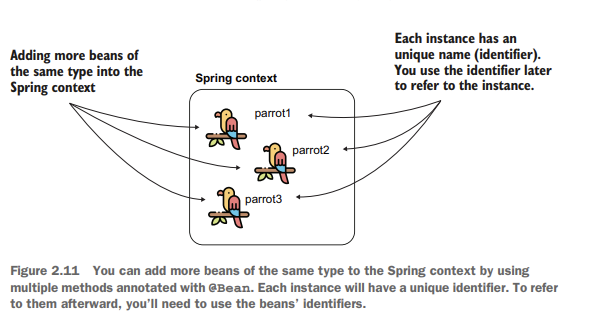

**Figure 2.11 You can add more beans of the same type to the Spring context by using multiple methods annotated with @Bean. Each instance will have a unique identifier. To refer to them afterward, you’ll need to use the beans’ identifiers.**

**NOTE** Don’t confuse the name of the bean with the name of the
(**LƯU Ý** Đừng nhầm lẫn tên của đậu với tên của)
parrot. In our example, the beans’ names (or identifiers) in the Spring context are par-rot1, parrot2, and parrot3 (like the name of the @Bean methods defining them). The names I gave to the parrots are Koko, Miki, and Riki. The parrot name is just an attribute of the Parrot object, and it doesn’t mean anything to Spring.
(con vẹt. Trong ví dụ của chúng tôi, tên (hoặc mã định danh) của đậu trong ngữ cảnh Mùa xuân là par-rot1, Parrot2 và Parrot3 (giống như tên của các phương thức @Bean xác định chúng). Tên tôi đặt cho những con vẹt là Koko, Miki và Riki. Tên vẹt chỉ là một thuộc tính của đối tượng Parrot và nó không có ý nghĩa gì đối với Spring.)

You can declare as many instances of the same type as you wish by simply declaring more methods annotated with the @Bean annotation. The following listing shows you how I’ve declared three beans of type Parrot in the configuration class. You find this example with the project “sq-ch2-ex3.”
(Bạn có thể khai báo bao nhiêu phiên bản cùng loại tùy thích bằng cách khai báo thêm các phương thức được chú thích bằng chú thích @Bean. Danh sách sau đây cho bạn thấy cách tôi khai báo ba loại đậu Parrot trong lớp cấu hình. Bạn tìm thấy ví dụ này với dự án “sq-ch2-ex3.”)

**Listing 2.13 Adding multiple beans of the same type to the Spring context**
(**Liệt kê 2.13 Thêm nhiều loại đậu cùng loại vào ngữ cảnh Mùa xuân**)

@Configuration

public class ProjectConfig {

@Bean

Parrot parrot1() {

var p = new Parrot(); p.setName("Koko"); return p;

}

@Bean

Parrot parrot2() {

var p = new Parrot(); p.setName("Miki"); return p;

}

@Bean

Parrot parrot3() {

var p = new Parrot();

p.setName("Riki"); return p;
(p.setName("Riki"); trả lại p;)

}

}

Of course, you can’t get the beans from the context anymore by only specifying the type. If you do, you’ll get an exception because Spring cannot guess which instance you’ve declared you refer to. Look at the following listing. Running such a code throws an exception in which Spring tells you that you need to be precise, which is the instance you want to use.
(Tất nhiên, bạn không thể lấy các hạt đậu từ ngữ cảnh nữa bằng cách chỉ xác định loại. Nếu làm vậy, bạn sẽ nhận được một ngoại lệ vì Spring không thể đoán được trường hợp nào bạn đã khai báo mà bạn đề cập đến. Nhìn vào danh sách sau đây. Việc chạy mã như vậy sẽ tạo ra một ngoại lệ trong đó Spring cho bạn biết rằng bạn cần phải chính xác, đó là trường hợp bạn muốn sử dụng.)

**Listing 2.14 Referring to a Parrot instance by type**
(**Liệt kê 2.14 Tham chiếu đến một cá thể Parrot theo loại**)

public class Main {

public static void main(String\[\] args) { var context = new

AnnotationConfigApplicationContext(ProjectConfig.class);
(AnnotationConfigApplicationContext(ProjectConfig.class);)

Parrot p = context.getBean(Parrot.class); System.out.println(p.getName());

}

}

**You’ll get an exception on this line because Spring cannot guess which of the three Parrot instances you refer to.**
(**Bạn sẽ có một ngoại lệ ở dòng này vì Spring không thể đoán được bạn đang đề cập đến phiên bản Parrot nào trong số ba phiên bản Parrot.**)

When running your application, you’ll get an exception similar to the one presented by the next code snippet.
(Khi chạy ứng dụng của bạn, bạn sẽ nhận được một ngoại lệ tương tự như ngoại lệ được trình bày trong đoạn mã tiếp theo.)

Exception in thread "main" org.springframework.beans.factory.NoUniqueBeanDefinitionException: No qualifying bean of type 'main.Parrot' available: expected single matching bean but found 3:

parrot1,parrot2,parrot3 at …
(vẹt1, vẹt2, vẹt3 tại …)

**Names of the Parrot beans in the context**
(**Tên của các loại đậu Parrot trong ngữ cảnh**)

To solve this ambiguity problem, you need to refer precisely to one of the instances by using the bean’s name. By default, Spring uses the names of the methods annotated with @Bean as the beans’ names themselves. Remember that’s why we don’t name the @Bean methods using verbs. In our case, the beans have the names parrot1, parrot2, and parrot3 (remember, the method represents the bean). You can find these names in the previous code snippet in the message of the exception. Did you spot them? Let’s change the main method to refer to one of these beans explicitly by using its name. Observe how I referred to the parrot2 bean in the following listing.
(Để giải quyết vấn đề mơ hồ này, bạn cần tham chiếu chính xác đến một trong các trường hợp bằng cách sử dụng tên của Bean. Theo mặc định, Spring sử dụng tên của các phương thức được chú thích bằng @Bean làm tên của các hạt đậu. Hãy nhớ rằng đó là lý do tại sao chúng ta không đặt tên cho các phương thức @Bean bằng động từ. Trong trường hợp của chúng ta, các hạt đậu có tên là con vẹt1, con vẹt2 và con vẹt3 (hãy nhớ rằng phương thức này đại diện cho hạt đậu). Bạn có thể tìm thấy những tên này trong đoạn mã trước đó trong thông báo về ngoại lệ. Bạn có phát hiện ra chúng không? Hãy thay đổi phương thức chính để đề cập rõ ràng đến một trong những loại đậu này bằng cách sử dụng tên của nó. Hãy quan sát cách tôi đề cập đến đậu Parrot2 trong danh sách sau đây.)

**Listing 2.15 Referring to a bean by its identifier**
(**Liệt kê 2.15 Tham chiếu đến một hạt đậu bằng mã định danh của nó**)

public class Main {

public static void main(String\[\] args) { var context = new

AnnotationConfigApplicationContext(ProjectConfig.class);
(AnnotationConfigApplicationContext(ProjectConfig.class);)

Parrot p = context.getBean("parrot2", Parrot.class);  System.out.println(p.getName());

}

}

**First parameter is the name of the instance to which we refer**
(**Tham số đầu tiên là tên của phiên bản mà chúng tôi đề cập đến**)

Running the app now, you’ll no longer get an exception. Instead, you’ll see in the console the name of the second parrot, Miki.
(Chạy ứng dụng ngay bây giờ, bạn sẽ không còn gặp ngoại lệ nữa. Thay vào đó, bạn sẽ thấy trong bảng điều khiển tên của con vẹt thứ hai, Miki.)

If you’d like to give another name to the bean, you can use either one of the name
(Nếu bạn muốn đặt tên khác cho Bean, bạn có thể sử dụng một trong các tên đó)

or the value attributes of the @Bean annotation. Any of the following syntaxes will change the name of the bean in "miki":
(hoặc các thuộc tính giá trị của chú thích @Bean. Bất kỳ cú pháp nào sau đây sẽ thay đổi tên của đậu trong "miki":)

- @Bean(name = "miki")
(- @Bean(name = "miki"))

- @Bean(value = "miki")
(- @Bean(giá trị = "miki"))

- @Bean("miki")
(- @Bean("miki"))

In the next code snippet, you can observe the change as it appears in code, and if you’d like to run this example, you find it in the project named “sq-ch2-ex4”:
(Trong đoạn mã tiếp theo, bạn có thể quan sát sự thay đổi khi nó xuất hiện trong mã và nếu muốn chạy ví dụ này, bạn sẽ tìm thấy nó trong dự án có tên “sq-ch2-ex4”:)

@Bean(name = "miki") Parrot parrot2() {

var p = new Parrot(); p.setName("Miki"); return p;

**Sets the name of the bean**
(**Đặt tên của đậu**)

**Sets the name of the parrot**
(**Đặt tên của con vẹt**)

}

**Defining a bean as primary**
(**Xác định một hạt đậu là chính**)

Earlier in this section we discussed that you could have multiple beans of the same kind in the Spring context, but you need to refer to them using their names. There’s another option when referring to beans in the context when you have more of the same type.
(Trước đó trong phần này, chúng ta đã thảo luận rằng bạn có thể có nhiều loại đậu cùng loại trong ngữ cảnh Mùa xuân, nhưng bạn cần tham chiếu đến chúng bằng tên của chúng. Có một lựa chọn khác khi đề cập đến các loại đậu trong ngữ cảnh khi bạn có nhiều loại cùng loại hơn.)

When you have multiple beans of the same kind in the Spring context you can make one of them *primary*. You mark the bean you want to be primary using the @Primary annotation. A primary bean is the one Spring will choose if it has multiple options and you don’t specify a name; the primary bean is simply Spring’s default choice. The next code snippet shows you what the @Bean method annotated as primary looks like:
(Khi bạn có nhiều loại đậu cùng loại trong ngữ cảnh Mùa xuân, bạn có thể tạo một trong số chúng *chính*. Bạn đánh dấu hạt bạn muốn là hạt chính bằng cách sử dụng chú thích @Primary. Bean chính là Bean sẽ chọn nếu nó có nhiều tùy chọn và bạn không chỉ định tên; Bean chính chỉ đơn giản là lựa chọn mặc định của Spring. Đoạn mã tiếp theo cho bạn biết phương thức @Bean được chú thích là chính trông như thế nào:)

@Bean @Primary

Parrot parrot2() {

var p = new Parrot(); p.setName("Miki"); return p;

}

If you refer to a Parrot without specifying the name, Spring will now select Miki by default. Of course, you can only define one bean of a type as primary. You find this example implemented in the project “sq-ch2-ex5.”
(Nếu bạn đề cập đến một con Vẹt mà không chỉ định tên, Spring sẽ chọn Miki theo mặc định. Tất nhiên, bạn chỉ có thể xác định một loại đậu là chính. Bạn tìm thấy ví dụ này được triển khai trong dự án “sq-ch2-ex5.”)

### Using stereotype annotations to add beans to the Spring context
### ### Sử dụng các chú thích rập khuôn để thêm đậu vào ngữ cảnh Mùa xuân

In this section, you’ll learn a different approach for adding beans to the Spring con-text (later in this chapter, we also compare the approaches and discuss when to choose one or another). Remember, adding beans to the Spring context is essential because it’s how you make Spring aware of the object instances of your application, which need to be managed by the framework. Spring offers you more ways to add beans to its context. In different scenarios, you’ll find using one of these approaches is more comfortable than another. For example, with stereotype annotations, you’ll observe you write less code to instruct Spring to add a bean to its context.
(Trong phần này, bạn sẽ tìm hiểu một cách tiếp cận khác để thêm đậu vào ngữ cảnh Spring (ở phần sau của chương này, chúng ta cũng so sánh các cách tiếp cận và thảo luận khi nào nên chọn cái này hay cái khác). Hãy nhớ rằng, việc thêm các Bean vào ngữ cảnh Spring là điều cần thiết vì đó là cách bạn làm cho Spring nhận biết được các phiên bản đối tượng của ứng dụng của bạn, những phiên bản này cần được quản lý bởi khung. Spring cung cấp cho bạn nhiều cách hơn để thêm đậu vào ngữ cảnh của nó. Trong các tình huống khác nhau, bạn sẽ thấy việc sử dụng một trong các phương pháp này sẽ thoải mái hơn các phương pháp khác. Ví dụ: với các chú thích khuôn mẫu, bạn sẽ thấy mình viết ít mã hơn để hướng dẫn Spring thêm một hạt đậu vào ngữ cảnh của nó.)

Later you’ll learn that Spring offers multiple stereotype annotations. But in this section, I want you to focus on how to use a stereotype annotation in general. We’ll take the most basic of these, @Component, and use it to demonstrate our examples.
(Sau này bạn sẽ biết rằng Spring cung cấp nhiều chú thích khuôn mẫu. Nhưng trong phần này, tôi muốn bạn tập trung vào cách sử dụng chú thích khuôn mẫu nói chung. Chúng ta sẽ lấy cái cơ bản nhất trong số này, @Component, và sử dụng nó để minh họa cho các ví dụ của mình.)

With stereotype annotations, you add the annotation above the class for which you
(Với các chú thích khuôn mẫu, bạn thêm chú thích phía trên lớp mà bạn)

need to have an instance in the Spring context. When doing so, we say that you’ve marked the class as a component. When the app creates the Spring context, Spring creates an instance of the class you marked as a component and adds that instance to its context. We’ll still have a configuration class when we use this approach to tell Spring where to look for the classes annotated with stereotype annotations. Moreover, you can use both the approaches (using @Bean and stereotype annotations together; we’ll work on these types of complex examples in later chapters).
(cần phải có một phiên bản trong bối cảnh Mùa xuân. Khi làm như vậy, chúng tôi nói rằng bạn đã đánh dấu lớp này là một thành phần. Khi ứng dụng tạo ngữ cảnh Spring, Spring sẽ tạo một phiên bản của lớp mà bạn đã đánh dấu là một thành phần và thêm phiên bản đó vào ngữ cảnh của nó. Chúng ta vẫn sẽ có một lớp cấu hình khi sử dụng phương pháp này để cho Spring biết nơi tìm các lớp được chú thích bằng các chú thích khuôn mẫu. Hơn nữa, bạn có thể sử dụng cả hai cách tiếp cận (sử dụng @Bean và các chú thích khuôn mẫu cùng nhau; chúng ta sẽ làm việc với các loại ví dụ phức tạp này trong các chương sau).)

The steps we need to follow in the process are as follows (figure 2.12):
(Các bước chúng ta cần thực hiện trong quy trình như sau (hình 2.12):)

**1** Using the @Component annotation, mark the classes for which you want Spring to add an instance to its context (in our case Parrot).
(**1** Sử dụng chú thích @Component, đánh dấu các lớp mà bạn muốn Spring thêm một phiên bản vào ngữ cảnh của nó (trong trường hợp của chúng ta là Parrot).)

**2** Using @ComponentScan annotation over the configuration class, instruct Spring on where to find the classes you marked.
(**2** Sử dụng chú thích @ComponentScan trên lớp cấu hình, hướng dẫn Spring nơi tìm các lớp bạn đã đánh dấu.)

Let’s take our example with the Parrot class. We can add an instance of the class in the Spring context by annotating the Parrot class with one of the stereotype annota-tions, say @Component.
(Hãy lấy ví dụ của chúng ta với lớp Parrot. Chúng ta có thể thêm một thể hiện của lớp trong ngữ cảnh Spring bằng cách chú thích lớp Parrot bằng một trong các chú thích khuôn mẫu, chẳng hạn như @Component.)

**STEP 1**
(**BƯỚC 1**)

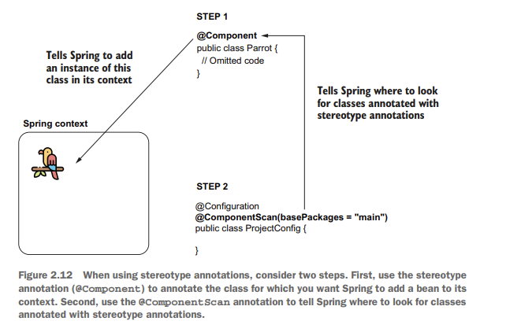

**@Component**
(**@Thành phần**)

public class Parrot {

// Omitted code
(// Mã bị bỏ qua)

}

**Tells Spring where to look for classes annotated with stereotype annotations**
(**Cho Spring biết nơi tìm các lớp được chú thích bằng các chú thích khuôn mẫu**)

**STEP 2**
(**BƯỚC 2**)

@Configuration **@ComponentScan(basePackages = "main")** public class ProjectConfig {

}

**Figure 2.12 When using stereotype annotations, consider two steps. First, use the stereotype annotation (@Component) to annotate the class for which you want Spring to add a bean to its context. Second, use the @ComponentScan annotation to tell Spring where to look for classes annotated with stereotype annotations.**
(**Hình 2.12 Khi sử dụng chú thích khuôn mẫu, hãy xem xét hai bước. Đầu tiên, sử dụng chú thích khuôn mẫu (@Component) để chú thích lớp mà bạn muốn Spring thêm đậu vào ngữ cảnh của nó. Thứ hai, sử dụng chú thích @ComponentScan để cho Spring biết nơi tìm các lớp được chú thích bằng chú thích khuôn mẫu.**)

The next listing shows you how to use the @Component annotation for the Parrot class. You can find this example in the project “sq-ch2-ex6.”
(Listing tiếp theo cho bạn thấy cách sử dụng annotation @Component cho class Parrot. Bạn có thể tìm thấy ví dụ này trong dự án “sq-ch2-ex6”.)

**Listing 2.16 Using a stereotype annotation for the Parrot class**
(**Listing 2.16 Sử dụng stereotype annotation cho class Parrot**)

**By using the @Component annotation over the class, we instruct Spring to create an instance of this class and add it to its context.**
(**Bằng cách sử dụng annotation @Component trên class, chúng ta chỉ dẫn Spring tạo một đối tượng của class này và thêm nó vào context.**)

```java
@Component
public class Parrot {
    private String name;

    public String getName() {
        return name;
    }

    public void setName(String name) {
        this.name = name;
    }
}
```

But wait! This code won’t work just yet. By default, Spring doesn’t search for classes annotated with stereotype annotations, so if we just leave the code as-is, Spring won’t add a bean of type Parrot in its context. To tell Spring it needs to search for classes annotated with stereotype annotations, we use the @ComponentScan annotation over the configu-ration class. Also, with the @ComponentScan annotation, we tell Spring where to look for these classes. We enumerate the packages where we defined the classes with stereotype annotations. The next listing shows you how to use the @ComponentScan annotation over the configuration class of the project. In my case, the name of the package is “main.”
(Nhưng chờ đã! Đoạn code này vẫn chưa hoạt động ngay. Mặc định, Spring không tìm kiếm các class được gắn stereotype annotation, vì vậy nếu chúng ta cứ để code như vậy, Spring sẽ không thêm bean kiểu Parrot vào context. Để nói với Spring rằng nó cần tìm kiếm các class được gắn stereotype annotation, chúng ta dùng annotation @ComponentScan trên class cấu hình. Ngoài ra, với annotation @ComponentScan, chúng ta nói cho Spring biết nơi cần tìm các class này. Chúng ta liệt kê các package nơi chúng ta đã định nghĩa các class có stereotype annotation. Listing tiếp theo cho bạn thấy cách dùng annotation @ComponentScan trên class cấu hình của dự án. Trong trường hợp của tôi, tên package là “main”.)

**Listing 2.17 Using the @ComponentScan annotation to tell Spring where to look**
(**Listing 2.17 Sử dụng annotation @ComponentScan để nói cho Spring biết nơi cần tìm**)

```java
@Configuration
@ComponentScan(basePackages = "main")
public class ProjectConfig {

}
```

Now you told Spring the following:
(Bây giờ bạn đã nói với Spring những điều sau:)

**Using the basePackages attribute of the annotation, we tell Spring where to look for classes annotated with stereotype annotations.**
(**Bằng cách sử dụng thuộc tính basePackages của annotation, chúng ta nói cho Spring biết nơi cần tìm các class được gắn stereotype annotation.**)

**1** Which classes to add an instance to its context (Parrot)
(**1** Class nào cần thêm một đối tượng vào context của nó (Parrot))

**2** Where to find these classes (using @ComponentScan)
(**2** Tìm các class này ở đâu (bằng cách sử dụng @ComponentScan))

**NOTE** We don’t need methods anymore to define the beans. And it now
(**LƯU Ý** Chúng ta không cần method nữa để định nghĩa bean. Và bây giờ)
looks like this approach is better because you achieve the same thing by writ-ing less code. But wait until the end of this chapter. You’ll learn that both approaches are useful, depending on the scenario.
(có vẻ như cách tiếp cận này tốt hơn vì bạn đạt được cùng một kết quả nhưng viết ít code hơn. Nhưng hãy chờ đến cuối chương này. Bạn sẽ học rằng cả hai cách tiếp cận đều hữu ích, tùy theo tình huống.)

You can continue writing the main method as presented in the following listing to prove that Spring creates and adds the bean in its context.
(Bạn có thể tiếp tục viết phương thức main như được trình bày trong listing sau để chứng minh rằng Spring tạo và thêm bean vào context của nó.)

**Listing 2.18 Defining the main method to test the Spring configuration**
(**Listing 2.18 Định nghĩa phương thức main để kiểm tra cấu hình Spring**)

**Prints the default String representation of the instance taken from the Spring context**
(**In ra biểu diễn String mặc định của đối tượng được lấy từ Spring context**)

**Prints null because we did not assign any name to the parrot instance added by Spring in its context**
(**In ra null vì chúng ta chưa gán bất kỳ tên nào cho đối tượng parrot được Spring thêm vào context của nó**)

```java
public class Main {

    public static void main(String[] args) {
        var context = new AnnotationConfigApplicationContext(ProjectConfig.class);

        Parrot p = context.getBean(Parrot.class);

        System.out.println(p);
        System.out.println(p.getName());
    }
}
```

Running this application, you’ll observe Spring added a Parrot instance to its context because the first value printed is the default String representation of this instance. However, the second value printed is null because we did not assign any name to this parrot. Spring just creates the instance of the class, but it’s still our duty if we want to change this instance in any way afterward (like assigning it a name).
(Chạy ứng dụng này, bạn sẽ quan sát thấy Spring đã thêm một phiên bản Parrot vào ngữ cảnh của nó vì giá trị đầu tiên được in là biểu diễn Chuỗi mặc định của phiên bản này. Tuy nhiên, giá trị thứ hai được in ra là null vì chúng ta chưa gán bất kỳ tên nào cho chú vẹt này. Spring chỉ tạo ra một thể hiện của lớp, nhưng nhiệm vụ của chúng ta vẫn là nếu sau này chúng ta muốn thay đổi thể hiện này theo bất kỳ cách nào (chẳng hạn như đặt tên cho nó).)

Now that we’ve covered the two most frequently encountered ways you add beans to the Spring context, let’s make a short comparison of them
(Bây giờ chúng ta đã đề cập đến hai cách thường gặp nhất mà bạn thêm đậu vào ngữ cảnh Mùa xuân, hãy so sánh ngắn gọn về chúng)
(table 2.1).
((bảng 2.1).)

What you’ll observe is that in real-world scenarios you’ll use stereotype annotations as much as possible (because this approach implies writing less code), and you’ll only use the @Bean when you can’t add the bean otherwise (e.g., you create the bean for a class that is part of a library so you cannot modify that class to add the stereotype annotation).
(Điều bạn sẽ quan sát là trong các tình huống thực tế, bạn sẽ sử dụng chú thích khuôn mẫu nhiều nhất có thể (vì cách tiếp cận này ngụ ý viết ít mã hơn) và bạn sẽ chỉ sử dụng @Bean khi bạn không thể thêm đậu bằng cách khác (ví dụ: bạn tạo đậu cho một lớp là một phần của thư viện nên bạn không thể sửa đổi lớp đó để thêm chú thích khuôn mẫu).)

**Table 2.1 Advantages and disadvantages: A comparison of the two ways of adding beans to the Spring context, which tells you when you would use either of them**
(**Bảng 2.1 Ưu điểm và nhược điểm: So sánh hai cách thêm đậu vào ngữ cảnh Spring, cho bạn biết khi nào bạn sẽ sử dụng một trong hai cách**)

<table style="width:80%;"> <colgroup> <col style="width: 43%" /> <col style="width: 36%" /> </colgroup> <thead> <tr> <th><blockquote> <p><strong>Using the @Bean annotation</strong></p> </blockquote></th> <th><blockquote> <p><strong>Using stereotype annotations</strong></p> </blockquote></th> </tr> </thead> <tbody> <tr> <td><ol type="1"> <li><p>You have full control over the instance creation you add to the Spring context. It is your responsibility to create and configure the instance in the body of the method annotated with @Bean. Spring only takes that instance and adds it to the context as-is.</p></li> <li><p>You can use this method to add more instances of the same type to the Spring context. Remember, in section 2.1.1 we added three Parrot instances into the Spring context.</p></li> <li><p>You can use the @Bean annotation to add to the Spring context any object instance. The class that defines the instance doesn’t need to be defined in your app. Remember, earlier we added a String and an Integer to the Spring context.</p></li> <li><p>You need to write a separate method for each bean you create, which adds boilerplate code to your app. For this reason, we prefer using @Bean as a second option to stereotype annotations in our projects.</p></li> </ol></td> <td><ol type="1"> <li><p>You only have control over the instance after the framework creates it.</p></li> <li><p>This way, you can only add one instance of the class to the context.</p></li> <li><p>You can use stereotype annotations only to create beans of the classes your applica-tion owns. For example, you couldn’t add a bean of type String or Integer like we did in section 2.1.1 with the @Bean annota-tion because you don’t own these classes to change them by adding a stereotype annotation.</p></li> <li><p>Using stereotype annotations to add beans to the Spring context doesn’t add boiler-plate code to your app. You’ll prefer this approach in general for the classes that belong to your app.</p></li> </ol></td> </tr> </tbody> </table>

**Using @PostConstruct to manage the instance after its creation**
(**Sử dụng @PostConstruct để quản lý phiên bản sau khi tạo**)

As we’ve discussed in this section, using stereotype annotations you instruct Spring to create a bean and add it to its context. But, unlike using the @Bean annotation, you don’t have full control over the instance creation. Using @Bean, we were able to define a name for each of the Parrot instances we added to the Spring context, but using @Component, we didn’t get a chance to do something after Spring called the constructor of the Parrot class. What if we want to execute some instructions right after Spring creates the bean? We can use the @PostConstruct annotation.
(Như chúng ta đã thảo luận trong phần này, bằng cách sử dụng các chú thích khuôn mẫu, bạn hướng dẫn Spring tạo một Bean và thêm nó vào ngữ cảnh của nó. Tuy nhiên, không giống như sử dụng chú thích @Bean, bạn không có toàn quyền kiểm soát việc tạo phiên bản. Bằng cách sử dụng @Bean, chúng tôi có thể xác định tên cho từng phiên bản Parrot mà chúng tôi đã thêm vào ngữ cảnh Spring, nhưng khi sử dụng @Component, chúng tôi không có cơ hội làm điều gì đó sau khi Spring gọi hàm tạo của lớp Parrot. Điều gì sẽ xảy ra nếu chúng ta muốn thực thi một số lệnh ngay sau khi Spring tạo Bean? Chúng ta có thể sử dụng chú thích @PostConstruct.)

Spring borrows the @PostConstruct annotation from Java EE. We can also use this annotation with Spring beans to specify a set of instructions Spring executes after the bean creation. You just need to define a method in the component class and annotate that method with @PostConstruct, which instructs Spring to call that method after the constructor finishes its execution.
(Spring mượn chú thích @PostConstruct từ Java EE. Chúng ta cũng có thể sử dụng chú thích này với Spring Beans để chỉ định một tập hợp các hướng dẫn mà Spring thực thi sau khi tạo Bean. Bạn chỉ cần định nghĩa một phương thức trong lớp thành phần và chú thích phương thức đó bằng @PostConstruct, hướng dẫn Spring gọi phương thức đó sau khi hàm tạo kết thúc quá trình thực thi của nó.)

Let’s add to pom.xml the Maven dependency needed to use the @PostConstruct
(Hãy thêm vào pom.xml phần phụ thuộc Maven cần thiết để sử dụng @PostConstruct)

annotation:
(chú thích:)

\<dependency\>

\<groupId\>javax.annotation\</groupId\>

\<artifactId\>javax.annotation-api\</artifactId\>

\<version\>1.3.2\</version\>

\</dependency\>

You don’t need to add this dependency if you use a Java version smaller than Java
(Bạn không cần thêm phần phụ thuộc này nếu bạn sử dụng phiên bản Java nhỏ hơn Java)

11\. Before Java 11, the Java EE dependencies were part of the JDK. With Java 11, the JDK was cleaned of the APIs not related to SE, including the Java EE dependencies.
(11\. Trước Java 11, các phần phụ thuộc Java EE là một phần của JDK. Với Java 11, JDK đã được loại bỏ các API không liên quan đến SE, bao gồm cả các phần phụ thuộc Java EE.)

If you wish to use functionalities that were part of the removed APIs
(Nếu bạn muốn sử dụng các chức năng là một phần của API đã bị xóa)
(like @PostCon-struct), you now need to explicitly add the dependency
((như @PostCon-struct), bây giờ bạn cần thêm phần phụ thuộc một cách rõ ràng)
in your app.
(trong ứng dụng của bạn.)

Now you can define a method in the Parrot class, as presented in the next code snippet:
(Bây giờ bạn có thể định nghĩa một phương thức trong lớp Parrot, như được trình bày trong đoạn mã tiếp theo:)

@Component

public class Parrot { private String name;

@PostConstruct public void init() {

this.name = "Kiki";
(this.name = "Kiki";)

}

// Omitted code
(// Mã bị bỏ qua)

}

You find this example in the project “sq-ch2-ex7.” If you now print the name of the parrot in the console, you’ll observe the app prints the value Kiki in the console.
(Bạn tìm thấy ví dụ này trong dự án “sq-ch2-ex7.” Nếu bây giờ bạn in tên của con vẹt trong bảng điều khiển, bạn sẽ thấy ứng dụng in giá trị Kiki trong bảng điều khiển.)

Very similarly, but less encountered in real-world apps, you can use an annotation named @PreDestroy. With this annotation, you define a method that Spring calls imme-diately before closing and clearing the context. The @PreDestroy annotation is also described in JSR-250 and borrowed by Spring. But generally I recommend developers avoid using it and find a different approach to executing something before Spring clears the context, mainly because you can expect Spring to fail to clear the context. Say you defined something sensitive (like closing a database connection) in the @Pre-Destroy method; if Spring doesn’t call the method, you may get into big problems.
(Rất tương tự nhưng ít gặp hơn trong các ứng dụng trong thế giới thực, bạn có thể sử dụng chú thích có tên @PreDestroy. Với chú thích này, bạn xác định một phương thức mà Spring gọi ngay lập tức trước khi đóng và xóa ngữ cảnh. Chú thích @PreDestroy cũng được mô tả trong JSR-250 và được Spring mượn. Nhưng nói chung, tôi khuyên các nhà phát triển nên tránh sử dụng nó và tìm một cách tiếp cận khác để thực thi điều gì đó trước khi Spring xóa ngữ cảnh, chủ yếu là vì bạn có thể mong đợi Spring không xóa được ngữ cảnh. Giả sử bạn đã xác định điều gì đó nhạy cảm (chẳng hạn như đóng kết nối cơ sở dữ liệu) trong phương thức @Pre-Destroy; nếu Spring không gọi phương thức này, bạn có thể gặp vấn đề lớn.)

### Programmatically adding beans to the Spring context
### ### Thêm đậu vào ngữ cảnh mùa xuân theo chương trình

In this section, we discuss adding beans programmatically to the Spring context. We’ve had the option of programmatically adding beans to the Spring context with Spring 5, which offers great flexibility because it enables you to add new instances in the context directly by calling a method of the context instance. You’d use this approach when you want to implement a custom way of adding beans to the context and the @Bean or the stereotype annotations are not enough for your needs. Say you need to register specific beans in the Spring context depending on specific configura-tions of your application. With the @Bean and stereotype annotations, you can imple-ment most of the scenarios, but you can’t do something like the code presented in the next snippet:
(Trong phần này, chúng ta thảo luận về việc thêm các Bean theo chương trình vào bối cảnh Spring. Chúng tôi đã có tùy chọn thêm các Bean theo chương trình vào ngữ cảnh Spring với Spring 5, điều này mang lại sự linh hoạt cao vì nó cho phép bạn thêm trực tiếp các phiên bản mới vào ngữ cảnh bằng cách gọi một phương thức của phiên bản ngữ cảnh. Bạn sẽ sử dụng phương pháp này khi muốn triển khai một cách tùy chỉnh để thêm đậu vào ngữ cảnh và @Bean hoặc các chú thích khuôn mẫu không đủ cho nhu cầu của bạn. Giả sử bạn cần đăng ký các loại đậu cụ thể trong ngữ cảnh Mùa xuân tùy thuộc vào cấu hình cụ thể của ứng dụng của bạn. Với chú thích @Bean và khuôn mẫu, bạn có thể triển khai hầu hết các tình huống, nhưng bạn không thể làm điều gì đó giống như mã được trình bày trong đoạn mã tiếp theo:)

if (condition) { registerBean(b1);

} else {
(} khác {)

registerBean(b2);
(registerBean(b2);)

}

**If the condition is true, add a specific bean to the Spring context.**
(**Nếu điều kiện đúng, hãy thêm một loại đậu cụ thể vào ngữ cảnh Mùa xuân.**)

**Otherwise, add another bean to the Spring context.**

To keep using our parrots example, the scenario is as follows: The app reads a collec-tion of parrots. Some of them are green; others are orange. You want the app to add to the Spring context only the parrots that are green (figure 2.13).
(Để tiếp tục sử dụng ví dụ về vẹt của chúng tôi, kịch bản như sau: Ứng dụng đọc một bộ sưu tập các loài vẹt. Một số trong số chúng có màu xanh lá cây; những người khác có màu cam. Bạn muốn ứng dụng chỉ thêm những con vẹt có màu xanh lục vào bối cảnh Mùa xuân (hình 2.13).)

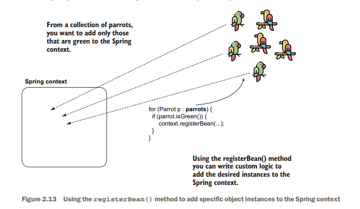

**From a collection of parrots, you want to add only those that are green to the Spring context.**
(**Từ bộ sưu tập vẹt, bạn chỉ muốn thêm những con có màu xanh lục vào bối cảnh Mùa xuân.**)

**Spring context**
(**Bối cảnh mùa xuân**)

for (Parrot p : **parrots**) { if (parrot.isGreen()) {

context.registerBean(...);

}

}

**Using the registerBean() method you can write custom logic to add the desired instances to the Spring context.**
(**Sử dụng phương thức registerBean() bạn có thể viết logic tùy chỉnh để thêm các đối tượng mong muốn vào Spring context.**)

**Figure 2.13 Using the registerBean() method to add specific object instances to the Spring context**
(**Hình 2.13 Sử dụng phương thức registerBean() để thêm các đối tượng cụ thể vào Spring context**)

Let’s see how this method works. To add a bean to the Spring context using a pro-grammatic approach, you just need to call the registerBean() method of the Appli-cationContext instance. The registerBean() has four parameters, as presented in the next code snippet:
(Hãy xem phương thức này hoạt động như thế nào. Để thêm một bean vào Spring context theo cách lập trình trực tiếp, bạn chỉ cần gọi phương thức registerBean() của đối tượng ApplicationContext. Phương thức registerBean() có bốn tham số, như được trình bày trong đoạn mã tiếp theo:)

\<T\> void registerBean( String beanName, Class\<T\> beanClass, Supplier\<T\> supplier,
(\<T\> void registerBean( Chuỗi BeanName, Class\<T\> BeanClass, Nhà cung cấp\<T\> nhà cung cấp,)

BeanDefinitionCustomizer... customizers);

**1** Use the first parameter beanName to define a name for the bean you add in the Spring context. If you don’t need to give a name to the bean you’re adding, you can use null as a value when you call the method.
(**1** Sử dụng tham số đầu tiên beanName để định nghĩa tên cho bean mà bạn thêm vào Spring context. Nếu bạn không cần đặt tên cho bean đang thêm, bạn có thể dùng giá trị null khi gọi phương thức.)

**2** The second parameter is the class that defines the bean you add to the context. Say you want to add an instance of the class Parrot; the value you give to this parameter is Parrot.class.
(**2** Tham số thứ hai là class định nghĩa bean mà bạn thêm vào context. Giả sử bạn muốn thêm một đối tượng của lớp Parrot; giá trị bạn truyền cho tham số này là Parrot.class.)

**3** The third parameter is an instance of Supplier. The implementation of this Supplier needs to return the value of the instance you add to the context. Remember, Supplier is a functional interface you find in the java.util
(**3** Tham số thứ ba là một đối tượng Supplier. Phần cài đặt của Supplier này cần trả về giá trị của đối tượng mà bạn thêm vào context. Hãy nhớ rằng Supplier là một functional interface mà bạn tìm thấy trong package java.util)

.function package. The purpose of a supplier implementation is to return a value you define without taking parameters.
(.function. Mục đích của một cài đặt supplier là trả về một giá trị do bạn định nghĩa mà không nhận tham số đầu vào.)

**4** The fourth and last parameter is a varargs of BeanDefinitionCustomizer. (If this doesn’t sound familiar, that’s okay; the BeanDefinitionCustomizer is just an interface you implement to configure different characteristics of the bean; e.g., making it primary.) Being defined as a varargs type, you can omit this parameter entirely, or you can give it more values of type BeanDefinitionCustomizer.
(**4** Tham số thứ tư và cũng là tham số cuối cùng là một varargs của BeanDefinitionCustomizer. (Nếu điều này nghe chưa quen thì cũng không sao; BeanDefinitionCustomizer chỉ là một interface mà bạn triển khai để cấu hình các đặc điểm khác nhau của bean, ví dụ như đặt nó làm primary.) Vì được định nghĩa dưới dạng varargs, bạn có thể bỏ hẳn tham số này hoặc truyền cho nó nhiều giá trị kiểu BeanDefinitionCustomizer.)

In the project “sq-ch2-ex8,” you find an example of using the registerBean() method. You observe that this project’s configuration class is empty, and the Parrot class we use for our bean definition example is just a plain old Java object (POJO); we use no annotation with it. In the next code snippet, you find the configuration class as I defined it for this example:
(Trong dự án “sq-ch2-ex8”, bạn sẽ thấy một ví dụ sử dụng phương thức registerBean(). Bạn sẽ nhận thấy lớp cấu hình của dự án này là rỗng, còn lớp Parrot mà chúng ta dùng cho ví dụ định nghĩa bean chỉ là một plain old Java object (POJO); chúng ta không dùng annotation nào với nó. Trong đoạn mã tiếp theo, bạn sẽ thấy lớp cấu hình như cách tôi định nghĩa cho ví dụ này:)

@Configuration

public class ProjectConfig {

}

I defined the class Parrot that we use to create the bean:
(Tôi đã định nghĩa lớp Parrot mà chúng ta dùng để tạo bean:)

public class Parrot { private String name;

// Omitted getters and setters
(// Getters và setters bị bỏ qua)

}

In the main method of the project, I’ve used the registerBean() method to add an instance of type Parrot to the Spring context. The next listing presents the code of the main method. Figure 2.14 focuses on the syntax for calling the registerBean() method.
(Trong phương thức main của dự án, tôi đã sử dụng phương thức registerBean() để thêm một đối tượng kiểu Parrot vào Spring context. Listing tiếp theo trình bày mã của phương thức main. Hình 2.14 tập trung vào cú pháp khi gọi phương thức registerBean().)

**Listing 2.19 Using the registerBean() method to add a bean to the Spring context**
(**Listing 2.19 Sử dụng phương thức registerBean() để thêm một bean vào Spring context**)

public class Main {

public static void main(String\[\] args) { var context =

new AnnotationConfigApplicationContext(

ProjectConfig.class);

Parrot x = new Parrot(); x.setName("Kiki");

**We create the instance we want to add to the Spring context.**
(**Chúng ta tạo đối tượng mà mình muốn thêm vào Spring context.**)

**We define a Supplier to**
(**Chúng ta định nghĩa một Supplier để**)

Supplier\<Parrot\> parrotSupplier = () -\> x; **return this instance.**
(Supplier\<Parrot\> parrotSupplier = () -\> x; **trả về đối tượng này.**)

context.registerBean("parrot1", Parrot.class, parrotSupplier);

**We call the registerBean() method to add the instance to the Spring context.**
(**Chúng ta gọi phương thức registerBean() để thêm đối tượng vào Spring context.**)

Parrot p = context.getBean(Parrot.class); System.out.println(p.getName());

}

}

**To verify the bean is now in the context, we refer to the parrot bean and print its name in the console.**
(**Để xác minh bean hiện đã nằm trong context, chúng ta tham chiếu đến bean parrot và in tên của nó ra console.**)

**The type of the bean**
(**Kiểu của bean**)

context.registerBean("parrot1", Parrot.class, parrotSupplier);

**The ApplicationContext instance**
(**Đối tượng ApplicationContext**)

**representing the Spring context**
(**đại diện cho Spring context**)

**The name we give to the bean that we add to**
(**Tên mà chúng ta đặt cho bean được thêm vào**)

**the Spring context**
(**Spring context**)

**The Supplier returning the**
(**Supplier trả về**)

**object instance that we add to the Spring context**
(**đối tượng mà chúng ta thêm vào Spring context**)

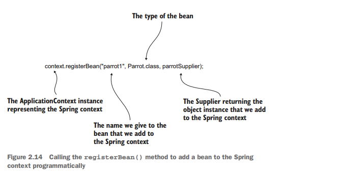

**Figure 2.14 Calling the registerBean() method to add a bean to the Spring context programmatically**
(**Hình 2.14 Gọi phương thức registerBean() để thêm một bean vào Spring context theo cách lập trình trực tiếp**)

Use one or more bean configurator instances as the last parameters to set different characteristics of the beans you add. For example, you can make the bean primary by changing the registerBean() method call, as shown in the next code snippet. A pri-mary bean defines the instance Spring selects by default if you have multiple beans of the same type in the context:
(Hãy dùng một hoặc nhiều đối tượng cấu hình bean làm các tham số cuối để thiết lập những đặc điểm khác nhau của bean mà bạn thêm vào. Ví dụ, bạn có thể đặt bean là primary bằng cách thay đổi lời gọi phương thức registerBean(), như được minh họa trong đoạn mã tiếp theo. Một primary bean xác định đối tượng mà Spring sẽ chọn mặc định nếu bạn có nhiều bean cùng kiểu trong context:)

context.registerBean("parrot1",

Parrot.class, parrotSupplier,
(Parrot.class, con vẹtNhà cung cấp,)

bc -\> bc.setPrimary(true));
(bc -\> bc.setPrimary(true));)

You’ve just made a first big step into the Spring world. Learning how to add beans to the Spring context might not seem like much, but it’s more important than it looks. With this skill, you can now proceed to referring to the beans in the Spring context, which we discuss in chapter 3.
(Bạn vừa thực hiện một bước lớn đầu tiên vào thế giới Spring. Việc học cách thêm bean vào Spring context có thể trông không quá lớn lao, nhưng nó quan trọng hơn những gì bạn nghĩ. Với kỹ năng này, giờ đây bạn có thể tiếp tục sang việc tham chiếu đến các bean trong Spring context, điều mà chúng ta sẽ thảo luận trong chương 3.)

**NOTE** In this book, we use only modern configuration approaches.
(**LƯU Ý** Trong cuốn sách này, chúng ta chỉ sử dụng các cách cấu hình hiện đại.)
However, I find it essential for you also to be aware of how the developers configured the framework in the early days of Spring. At that time, we were using XML to write these configurations. In appendix B, a short example is provided to give you a feeling on how you would use XML to add a bean to the Spring context.
(Tuy nhiên, tôi thấy điều quan trọng là bạn cũng nên biết các lập trình viên đã cấu hình framework như thế nào trong những ngày đầu của Spring. Vào thời điểm đó, chúng ta dùng XML để viết các cấu hình này. Ở phụ lục B có một ví dụ ngắn để giúp bạn hình dung cách dùng XML để thêm một bean vào Spring context.)

## Summary
## Tóm tắt
## ##Tóm tắt

- The first thing you need to learn in Spring is adding object instances
(- Điều đầu tiên bạn cần học trong Spring là thêm các thể hiện của đối tượng)
(which we call beans) to the Spring context. You can imagine the
((mà chúng tôi gọi là đậu) vào bối cảnh Mùa xuân. Bạn có thể tưởng tượng)
Spring context as a bucket in which you add the instances you expect Spring to be able to manage. Spring can see only the instances you add to its context.
(- Điều đầu tiên bạn cần học trong Spring là thêm các đối tượng (mà chúng ta gọi là bean) vào Spring context. Bạn có thể hình dung Spring context như một cái thùng nơi bạn đặt vào những đối tượng mà bạn mong Spring có thể quản lý. Spring chỉ có thể nhìn thấy những đối tượng mà bạn thêm vào context của nó.)

- You can add beans to the Spring context in three ways: using the @Bean
(- Bạn có thể thêm Beans vào Spring context theo 3 cách: sử dụng @Bean)
annota-tion, using stereotype annotations, and doing it programmatically.
(- Bạn có thể thêm bean vào Spring context theo ba cách: dùng annotation @Bean, dùng stereotype annotation và thêm theo cách lập trình trực tiếp.)

- Using the @Bean annotation to add instances to the Spring context
(- Sử dụng chú thích @Bean để thêm instance vào Spring context)
enables you to add any kind of object instance as a bean and even multiple instances of the same kind to the Spring context. From this point of view, this approach is more flexible than using stereotype annotations. Still, it requires you to write more code because you need to write a separate method in the configuration class for each independent instance added to the context.
(- Sử dụng annotation @Bean để thêm các đối tượng vào Spring context cho phép bạn thêm bất kỳ loại đối tượng nào dưới dạng bean và thậm chí thêm nhiều đối tượng cùng loại vào Spring context. Xét từ góc độ này, cách tiếp cận này linh hoạt hơn so với việc dùng stereotype annotation. Tuy nhiên, nó đòi hỏi bạn phải viết nhiều mã hơn vì bạn cần viết một phương thức riêng trong lớp cấu hình cho mỗi đối tượng độc lập được thêm vào context.)

- Using stereotype annotations, you can create beans for only the
(- Bằng cách sử dụng các chú thích khuôn mẫu, bạn có thể tạo các hạt đậu chỉ cho)
application classes with a specific annotation (e.g., @Component). This configuration approach requires writing less code, which makes your configuration more comfortable to read. You’ll prefer this approach over the @Bean annotation for classes that you define and can annotate.
(- Sử dụng stereotype annotation, bạn chỉ có thể tạo bean cho các class của ứng dụng được đánh dấu bằng một annotation cụ thể (ví dụ: @Component). Cách cấu hình này yêu cầu ít mã hơn, điều này làm cho cấu hình của bạn dễ đọc hơn. Bạn sẽ ưu tiên cách tiếp cận này hơn annotation @Bean đối với các class mà bạn tự định nghĩa và có thể gắn annotation.)

- Using the registerBean() method enables you to implement custom
(- Sử dụng phương thức registerBean() cho phép bạn triển khai các tùy chỉnh)
logic for adding beans to the Spring context. Remember, you can use this approach only with Spring 5 and later.
(- Sử dụng phương thức registerBean() cho phép bạn triển khai logic tùy chỉnh để thêm bean vào Spring context. Hãy nhớ rằng bạn chỉ có thể dùng cách tiếp cận này với Spring 5 trở lên.)
